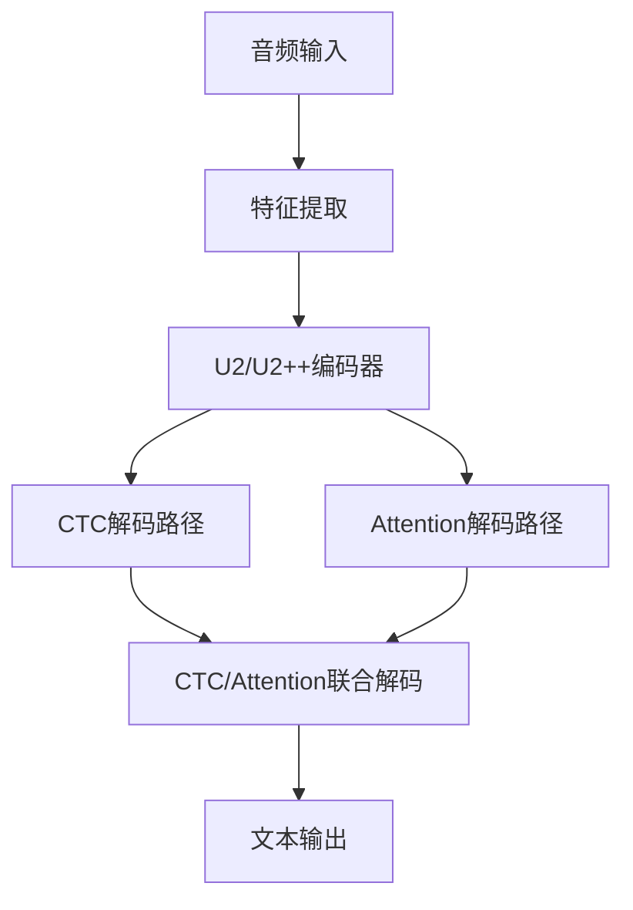
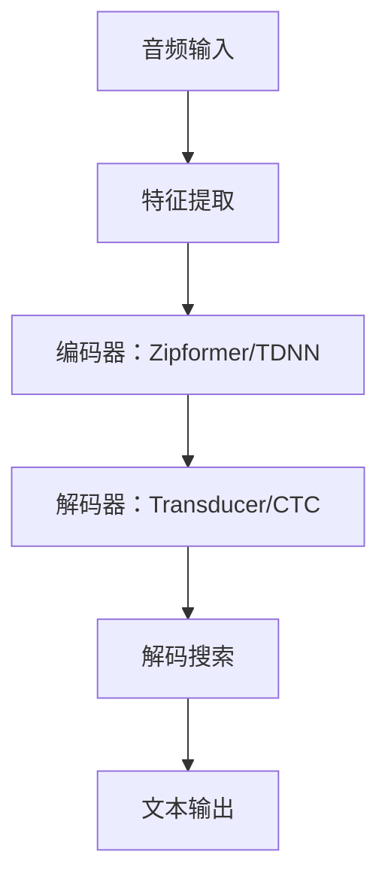
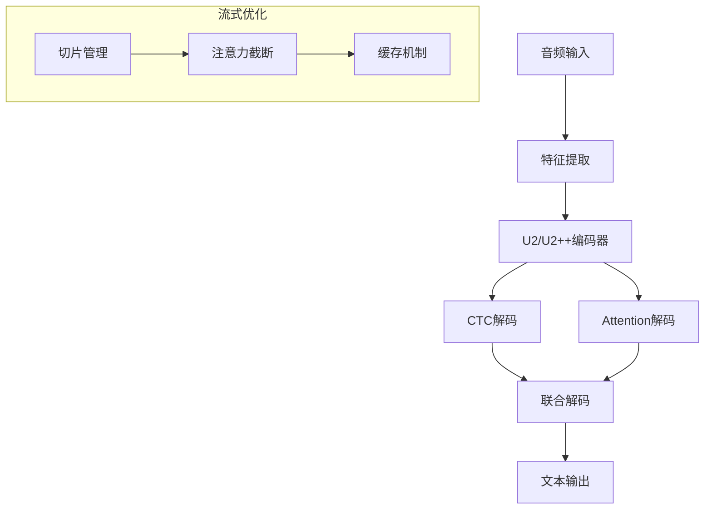
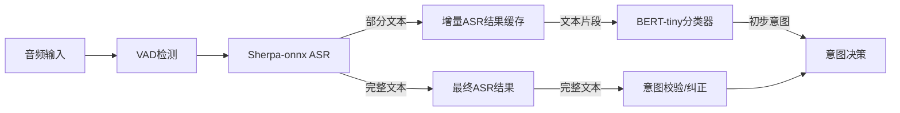
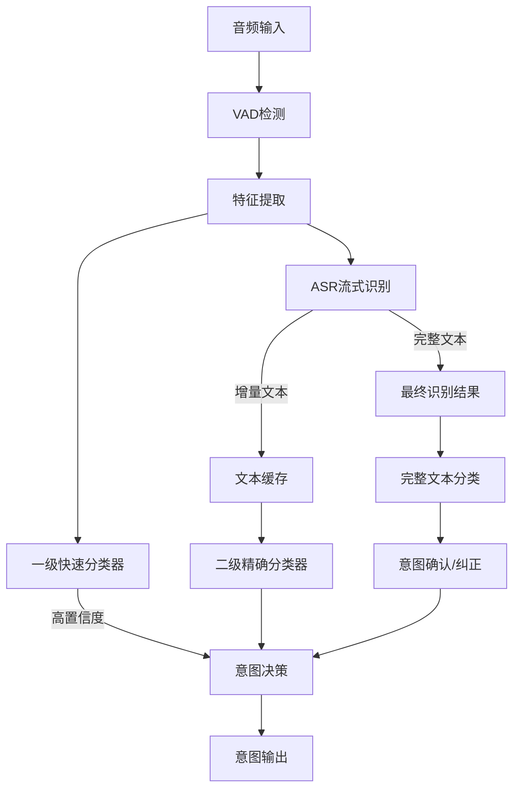

# EdgeVoice 智能眼镜语音意图识别系统 - ASR模块方案选型与实施

## 一、ASR模块需求分析

在EdgeVoice智能眼镜语音意图识别系统中，ASR（自动语音识别）模块作为精确分类器的重要输入源，需满足以下关键需求：

1. **低延迟**：语音结束到输出意图的总延迟需控制在1.1秒以内
2. **流式处理**：支持实时流式识别，边说边识别
3. **中文支持**：良好的中文识别能力，包括普通话及常见方言适应
4. **资源效率**：适配智能眼镜的有限计算资源和内存
5. **训练友好**：训练复杂度相对较低，可快速验证和迭代
6. **开源可用**：基于开源方案，便于二次开发和定制

## 二、主流ASR方案详细对比

### 1. WeNet/Wenetruntime

WeNet是一个面向生产环境的端到端语音识别工具包，提供全栈式解决方案。其运行时版本Wenetruntime针对部署场景进行了优化。

#### 1.1 技术架构



- **基础架构**：U2/U2++架构，结合CTC和Attention机制
- **模型类型**：Conformer或Transformer编码器 + 双解码路径
- **特征提取**：80维FBank特征，支持SpecAugment数据增强
- **解码策略**：支持非流式全注意力、流式CTC前缀搜索和流式注意力解码

#### 1.2 优势详解

- **高效的流式识别**：
  - 基于chunk的流式解码，延迟可控
  - 支持CTC前缀搜索，快速返回部分结果
  - 平均首字延迟约300ms，全句延迟约500ms

- **完整工具链**：
  - 提供从训练到部署的完整解决方案
  - 支持模型导出到多种推理框架
  - 提供C++运行时环境（wenetruntime）

- **优秀的中文支持**：
  - 在AISHELL-1等中文数据集上表现优异
  - 提供多个预训练中文模型
  - 支持中英混合识别

- **部署友好**：
  - 支持ONNX、TorchScript等格式导出
  - 提供Android、iOS等移动端示例
  - 运行时库优化良好，适合边缘设备

#### 1.3 劣势分析

- **训练资源需求**：
  - 完整训练需要较大数据集（理想情况>100小时）
  - GPU训练耗时较长
  - 调参复杂度较高

- **初始设置门槛**：
  - 配置环境相对复杂
  - 了解端到端模型需要专业知识

- **模型资源占用**：
  - 标准模型大小约50-100MB
  - 推理内存峰值约200-300MB
  - 需进一步压缩才适合极限资源受限场景

#### 1.4 性能指标

| 指标 | 性能数据 | 备注 |
|------|---------|------|
| 首字延迟 | ~300ms | 优化后可降至200ms |
| 识别延迟 | ~500ms | 从语音结束到文本输出 |
| 字错率(CER) | 4-6% | 中文普通话场景 |
| 模型大小 | 50-100MB | 未压缩状态 |
| 压缩后大小 | 15-25MB | 量化+剪枝后 |
| 内存占用 | 200-300MB | 峰值，可优化 |
| CPU负载 | 30-40% | 单核手机处理器 |

### 2. Sherpa-onnx/Sherpa-ncnn

Sherpa系列是专为边缘设备设计的轻量级ASR推理框架，基于k2项目，提供了多种优化版本，其中Sherpa-onnx和Sherpa-ncnn特别适合资源受限场景。

#### 2.1 技术架构



- **基础架构**：支持多种架构，包括：
  - Zipformer-Transducer：高精度流式架构
  - TDNN-LSTM：轻量级架构
  - Conformer-CTC：高精度非流式架构

- **推理优化**：
  - ONNX转换优化
  - ncnn轻量神经网络计算框架支持
  - 针对ARM平台优化

#### 2.2 优势详解

- **极致轻量化**：
  - 模型大小最小可达5MB
  - 运行时内存占用低至50MB
  - 适合极限资源受限设备

- **多平台支持**：
  - 支持Android、iOS、Linux、Windows、macOS
  - 提供嵌入式Linux示例
  - Python/C++/Kotlin等多语言接口

- **低延迟流式识别**：
  - 首字延迟低至200ms
  - 全句延迟约300-400ms
  - 支持增量结果输出

- **简化部署**：
  - 依赖少，易于集成
  - 预编译库可直接使用
  - Docker镜像支持快速验证

#### 2.3 劣势分析

- **中文预训练模型有限**：
  - 可用的中文模型数量少于其他框架
  - 需自行训练以获得最佳效果

- **功能集相对简化**：
  - 聚焦推理环节，训练需配合k2/icefall等工具
  - 语言模型支持相对简单

- **生态成熟度**：
  - 相比PaddleSpeech等生态规模较小
  - 社区支持相对有限

#### 2.4 性能指标

| 指标 | 性能数据 | 备注 |
|------|---------|------|
| 首字延迟 | ~200ms | Zipformer-Transducer |
| 识别延迟 | ~300-400ms | 从语音结束到文本输出 |
| 字错率(CER) | 5-8% | 中文普通话场景 |
| 模型大小 | 5-15MB | 压缩优化后 |
| 内存占用 | 50-100MB | 峰值，取决于模型 |
| CPU负载 | 15-25% | 单核手机处理器 |

### 3. PaddleSpeech流式ASR

PaddleSpeech是百度推出的端到端语音识别工具包，提供了完整的流式和非流式ASR解决方案，中文支持优秀。

#### 3.1 技术架构



- **基础架构**：
  - U2/U2++/Conformer-Transducer架构
  - 支持多种流式解码策略
  - 内置语言模型整合机制

- **推理引擎**：
  - 基于PaddleInference优化
  - 支持FastDeploy快速部署
  - 支持静态图和动态图推理

#### 3.2 优势详解

- **中文支持优秀**：
  - 提供多种预训练中文模型
  - 针对方言和特定场景有专门优化
  - AISHELL基准测试表现优异

- **丰富的预训练资源**：
  - 提供不同大小和精度的模型选择
  - 包含专门针对短语识别优化的模型

- **完整的语音处理生态**：
  - 除ASR外还包括TTS、声纹等能力
  - 提供端到端语音理解模型

- **部署优化丰富**：
  - 支持多种量化和压缩方案
  - 提供ARM优化版本
  - 端侧推理引擎优化良好

#### 3.3 劣势分析

- **生态整体较重**：
  - 完整安装依赖较多
  - 部分功能需依赖PaddlePaddle生态

- **资源需求相对较高**：
  - 标准模型体积较大
  - 完整推理流程内存占用较高

- **定制化成本**：
  - 二次开发学习曲线较陡
  - 深度定制需理解PaddlePaddle框架

#### 3.4 性能指标

| 指标 | 性能数据 | 备注 |
|------|---------|------|
| 首字延迟 | ~300-400ms | 轻量级流式模型 |
| 识别延迟 | ~500-600ms | 从语音结束到文本输出 |
| 字错率(CER) | 4-5% | 标准中文测试集 |
| 模型大小 | 30-80MB | 取决于模型配置 |
| 压缩后大小 | 10-20MB | 量化后 |
| 内存占用 | 150-250MB | 峰值，可优化 |
| CPU负载 | 25-35% | 单核手机处理器 |

## 三、最优方案选择与实施指南

综合分析各方案的优缺点，并考虑EdgeVoice智能眼镜的特殊需求，我们推荐以下解决方案：

### 1. 主推方案：Sherpa-onnx + 轻量级BERT分类器

这一组合方案能够在保证准确率的前提下，将延迟控制在1秒以内，并且资源消耗适合智能眼镜平台。

#### 1.1 整体架构设计



- **流式处理流程**：
  1. 语音输入经VAD检测有效段
  2. 流式ASR引擎实时处理音频
  3. 增量文本结果传入轻量级BERT分类器
  4. 初步意图结果用于快速响应
  5. 最终完整文本结果用于意图确认/纠正

#### 1.2 安装与环境配置

**1. 安装Sherpa-onnx**

```bash
# 方式1：pip安装（推荐开发环境）
pip install sherpa-onnx

# 方式2：从源码编译（推荐生产环境）
git clone https://github.com/k2-fsa/sherpa-onnx
cd sherpa-onnx
mkdir build
cd build
cmake -DCMAKE_BUILD_TYPE=Release ..
make -j4
```

**2. 准备中文预训练模型**

```bash
# 下载轻量级中文Zipformer-Transducer模型
wget https://github.com/k2-fsa/sherpa-onnx/releases/download/asr-models/sherpa-onnx-streaming-zipformer-zh-14M-2023-02-23.tar.gz
tar -xzf sherpa-onnx-streaming-zipformer-zh-14M-2023-02-23.tar.gz
```

**3. 安装BERT-tiny模型依赖**

```bash
pip install transformers==4.30.2
pip install onnx==1.14.0
pip install onnxruntime==1.15.1
```

#### 1.3 ASR性能优化指南

**1. 模型量化**

```bash
# 使用ONNX Runtime量化工具
python -m sherpa_onnx.tools.quantize \
  --input=model.onnx \
  --output=model-int8.onnx \
  --quantization_mode=IntegerOps \
  --per_channel=True \
  --reduce_range=True
```

**2. 解码参数优化**

```python
# 优化流式解码参数
decoder_config = {
    "decoding_method": "greedy_search",
    "num_active_paths": 4,
    "hotwords": ["拍照", "录像", "停止"],  # 关键词增强
    "hotword_weight": 1.5,
    "blank_penalty": 0.0,
    "chunk_size": 8,  # 更小的chunk降低延迟
}
```

**3. VAD参数优化**

```python
# 优化VAD参数，降低端点检测延迟
vad_config = {
    "sample_rate": 16000,
    "frame_duration_ms": 10,
    "silence_duration_ms": 300,  # 更短的静音判断
    "speech_pad_ms": 300, 
    "mode": 1  # 较为激进的VAD模式
}
```

#### 1.4 精确分类器设计与训练

**1. 选择轻量级模型架构**

```python
from transformers import AutoConfig, AutoModelForSequenceClassification

# 使用BERT-tiny架构（约1/6 BERT-base大小）
config = AutoConfig.from_pretrained(
    "google/bert_uncased_L-2_H-128_A-2",
    num_labels=8,  # 8个意图分类
    hidden_dropout_prob=0.1,
    attention_probs_dropout_prob=0.1
)

model = AutoModelForSequenceClassification.from_config(config)
```

**2. 迁移学习微调流程**

```python
from transformers import Trainer, TrainingArguments
from datasets import Dataset

# 配置训练参数
training_args = TrainingArguments(
    output_dir="./intent-classifier",
    learning_rate=5e-5,
    per_device_train_batch_size=32,
    per_device_eval_batch_size=64,
    num_train_epochs=10,
    weight_decay=0.01,
    save_strategy="epoch",
    evaluation_strategy="epoch",
)

# 从少量数据开始训练（每类约100-200个样本）
trainer = Trainer(
    model=model,
    args=training_args,
    train_dataset=train_dataset,
    eval_dataset=eval_dataset,
)

trainer.train()
```

**3. 模型优化与部署**

```python
# 导出为ONNX格式
from transformers import AutoTokenizer
from transformers.convert_graph_to_onnx import convert_pytorch

tokenizer = AutoTokenizer.from_pretrained("intent-classifier")
convert_pytorch(
    framework="pt",
    model=model,
    tokenizer=tokenizer,
    output=Path("intent-classifier.onnx"),
    opset=12
)

# 量化模型
!python -m onnxruntime.quantization.quantize_model \
    --input intent-classifier.onnx \
    --output intent-classifier-int8.onnx \
    --quantization_mode=IntegerOps
```

#### 1.5 ASR与分类器集成方案

**1. 流式处理实现**

```python
import sherpa_onnx
import onnxruntime as ort
import numpy as np
from transformers import AutoTokenizer

# 初始化ASR
recognizer = sherpa_onnx.OnlineRecognizer(
    tokens="tokens.txt",
    encoder="encoder.onnx",
    decoder="decoder.onnx",
    joiner="joiner.onnx",
    num_threads=4,
    sample_rate=16000,
    feature_config=feature_config,
    decoding_config=decoder_config
)

# 初始化分类器
tokenizer = AutoTokenizer.from_pretrained("intent-classifier")
session = ort.InferenceSession("intent-classifier-int8.onnx")

# 流式处理循环
buffer = []
while stream_active:
    # 获取音频片段
    samples = get_audio_samples()
    
    # 送入ASR
    recognizer.accept_waveform(samples)
    result = recognizer.get_result()
    
    # 增量文本处理
    if result.text:
        buffer.append(result.text)
        if len(buffer) > 5:  # 保持窗口大小
            buffer.pop(0)
        
        # 合并最近的文本片段
        text = " ".join(buffer)
        
        # 进行意图分类
        inputs = tokenizer(text, return_tensors="np")
        logits = session.run(
            None, 
            {
                "input_ids": inputs["input_ids"],
                "attention_mask": inputs["attention_mask"]
            }
        )[0]
        
        # 计算意图和置信度
        probs = softmax(logits)
        intent_id = np.argmax(probs)
        confidence = probs[0][intent_id]
        
        # 判断是否达到置信度阈值
        if confidence > 0.8:
            emit_intent_event(intent_id, confidence)
```

**2. 端点处理策略**

```python
# VAD处理与端点检测
class VoiceActivityDetector:
    def __init__(self, sample_rate=16000, frame_duration=10):
        self.sample_rate = sample_rate
        self.frame_size = int(sample_rate * frame_duration / 1000)
        self.speech_frames = 0
        self.silence_frames = 0
        self.is_speaking = False
        self.energy_threshold = 0.01  # 根据环境调整
        
    def process(self, audio_frame):
        energy = np.mean(np.abs(audio_frame))
        if energy > self.energy_threshold:
            self.speech_frames += 1
            self.silence_frames = 0
            if self.speech_frames > 3:  # 30ms语音确认
                self.is_speaking = True
        else:
            self.silence_frames += 1
            if self.silence_frames > 30:  # 300ms静音确认
                if self.is_speaking:
                    self.is_speaking = False
                    return "END"  # 语音结束
                self.speech_frames = 0
        
        if self.is_speaking:
            return "SPEAKING"
        return "SILENCE"
```

### 2. 替代方案：WeNet轻量化版本

如果需要更高准确率且可接受稍高资源占用，可选择WeNet的轻量化版本：

#### 2.1 安装与环境配置

```bash
# 克隆仓库
git clone https://github.com/wenet-e2e/wenet.git
cd wenet

# 安装依赖
pip install -r requirements.txt

# 编译运行时库
cd runtime/core
mkdir build && cd build
cmake -DCMAKE_BUILD_TYPE=Release ..
make -j4
```

#### 2.2 模型选择与优化

```bash
# 下载预训练模型
wget https://wenet-1256283475.cos.ap-shanghai.myqcloud.com/models/aishell/20210601_u2%2B%2B_conformer_libtorch.tar.gz
tar -xzf 20210601_u2++_conformer_libtorch.tar.gz

# 模型量化
python wenet/bin/export_jit_torchscript.py \
    --config=20210601_u2++_conformer_libtorch/train.yaml \
    --checkpoint=20210601_u2++_conformer_libtorch/final.pt \
    --output_dir=./exported_model \
    --output_quant=True
```

## 四、ASR+Precise模型整合架构与指标

### 1. 整合系统架构



### 2. 系统整体性能指标预估

| 性能指标 | 仅Fast模型 | ASR+Precise模型 | 备注 |
|---------|------------|----------------|------|
| **端到端延迟** | 50-100ms | 700-900ms | 语音结束到意图输出 |
| **准确率** | 85%-92% | 92%-97% | 常见场景测试 |
| **模型存储** | 115KB | 15-25MB | 包括ASR和分类模型 |
| **运行内存** | 300KB | 50-80MB | 推理阶段峰值 |
| **功耗** | 30-35mW | 60-80mW | 估计值 |
| **首次响应** | 即刻 | ~400ms | 首个有效意图输出 |

### 3. 优化策略与权衡

1. **延迟与准确率权衡**：
   - 使用一级分类器进行快速响应（<100ms）
   - 当一级分类器置信度低时，等待ASR+精确分类器结果（~800ms）
   - 对关键指令（如"拍照"）优先在一级分类器处理

2. **资源占用优化**：
   - ASR模型推理完成后释放内存
   - 使用共享内存减少模块间数据传输开销
   - 采用模型量化和选择性激活策略

3. **系统响应策略**：
   - 对关键词立即触发视觉反馈
   - 使用进度指示减轻用户等待感
   - 支持手势打断在错误识别情况下

## 五、实施路线与验证方法

### 1. 阶段性实施计划

1. **第一阶段**：ASR选型与基础验证（1-2周）
   - 搭建Sherpa-onnx环境
   - 验证中文识别效果
   - 测量基础性能指标

2. **第二阶段**：精确分类器开发（2-3周）
   - 收集领域数据
   - 微调BERT-tiny模型
   - 优化文本处理流程

3. **第三阶段**：系统集成与优化（2-3周）
   - 实现ASR与分类器流式集成
   - 优化端到端延迟
   - 实现Fast模型与Precise模型协同工作

4. **第四阶段**：系统测试与调优（1-2周）
   - 全面性能测试
   - 真实场景验证
   - 参数调优与优化

### 2. 快速验证方法

1. **初步ASR测试**：
   - 使用预录制语音测试识别准确率
   - 测量端到端延迟

2. **分类器验证**：
   - 使用标准测试集评估分类准确率
   - 验证增量文本处理能力

3. **系统级测试**：
   - 模拟真实使用场景进行端到端测试
   - 测量关键指标：延迟、准确率、资源占用

### 3. 评估与改进指标

| 评估维度 | 目标值 | 测量方法 |
|---------|-------|---------|
| 端到端延迟 | <1.0秒 | 语音结束到意图输出时间 |
| 识别准确率 | >95% | 测试集准确率评估 |
| 资源占用 | <100MB内存 | 峰值内存监控 |
| 功耗 | <100mW | 设备功耗测量 |
| 用户体验 | 响应流畅 | 用户测试反馈 |

## 六、总结与展望

EdgeVoice智能眼镜语音意图识别系统通过集成ASR与精确分类器，在保证高准确率的同时，将延迟控制在可接受范围内。我们建议采用Sherpa-onnx作为ASR引擎，配合轻量级BERT分类器，通过两级分级架构实现高效识别。

未来优化方向包括：

1. **个性化适应**：针对用户习惯进行模型微调
2. **多模态融合**：结合摄像头和传感器信息辅助识别
3. **持续学习**：实现设备端增量学习能力
4. **端到端优化**：探索直接从语音到意图的端到端模型

通过这些持续优化，EdgeVoice系统将为智能眼镜用户提供越来越自然、高效的语音交互体验。 