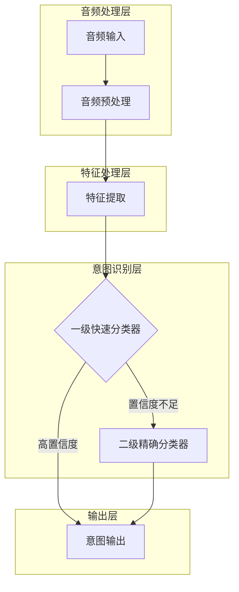
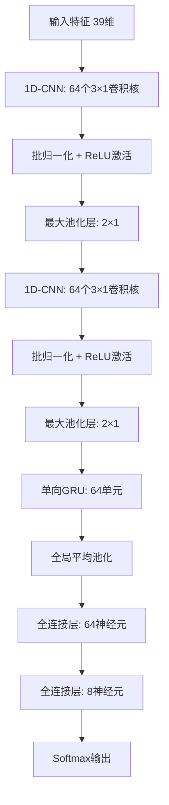
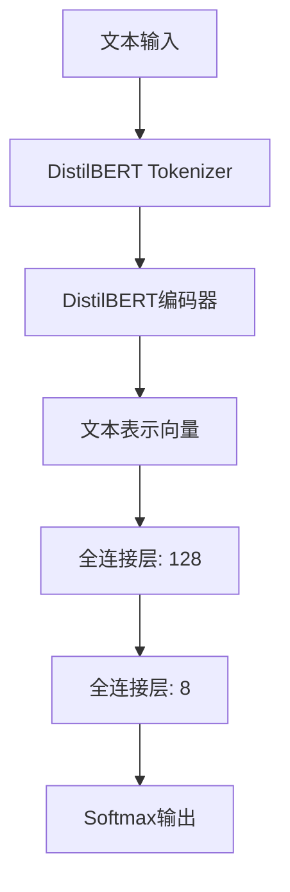

# EdgeVoice 智能眼镜语音意图识别系统技术方案详细说明

## 一、系统整体架构与数据流

EdgeVoice系统采用轻量级流水线架构，通过多个功能模块的有机组合，实现从语音输入到意图识别的全流程处理。系统特别优化了对智能眼镜上摄像相关功能的语音指令响应速度，在保证高准确率的同时，尽可能降低延迟和资源消耗。

### 1.1 整体架构图



### 1.2 详细数据流

下表详细描述了系统中各模块间的数据流，包括输入/输出格式和大小：

| 模块 | 输入 | 输出 | 处理内容 |
|------|-----|------|---------|
| **音频输入** | 连续音频流 (48kHz, 24bit, 单声道) | 音频帧 (10ms片段) | 接收麦克风输入的原始音频 |
| **VAD模块** | 音频帧 | 语音/非语音标记 + 筛选后的音频帧 | 检测有效语音段，过滤静音 |
| **音频预处理** | 原始音频帧 | 处理后音频 (16kHz, 16bit) | 重采样、位深转换、预加重、降噪 |
| **特征提取** | 处理后音频帧 | MFCC特征向量 (39维) | 提取声学特征及动态信息 |
| **一级分类器** | 特征向量 (39维) | 8类意图概率分布 + 置信度 | 快速分类并计算置信度 |
| **二级分类器** | 文本特征序列 | 8类意图概率分布 | 精确分类处理复杂表达 |
| **决策融合** | 两级分类器结果 | 最终意图标签 | 基于置信度和权重融合结果 |

### 1.3 模块间数据量详细计算

1. **音频输入**:
   - 输入数据率: 48,000(采样率) × 24(位)/8(字节) × 1(通道) = 144KB/秒
   - 考虑典型5秒指令: 约720KB原始数据

2. **音频预处理**:
   - 降采样后: 16,000(采样率) × 16(位)/8(字节) × 1(通道) = 32KB/秒
   - 对5秒指令: 降至160KB处理数据
   - 数据减少率: 77.8%

3. **特征提取**:
   - 帧长25ms, 帧移10ms: 每秒产生100帧
   - 每帧39维MFCC特征(含Delta和Delta-Delta): 39×4(浮点数字节) = 156字节/帧
   - 5秒指令特征量: 约78KB

4. **一级分类器处理**:
   - 输入: 39维特征向量
   - 输出: 8维意图概率向量(32字节)

5. **二级分类器处理**:
   - 输入: 文本特征序列(变长)
   - 输出: 8维意图概率向量(32字节)

## 二、一级快速分类器(Fast模型)详细设计

### 2.1 模型架构

一级快速分类器采用轻量级CNN-LSTM混合架构，针对延迟敏感型应用进行了优化，特别适合处理简单、高频的语音指令。



### 2.2 设计思路与原理

1. **CNN层**:
   - 使用两层一维CNN提取局部特征模式，每层后接批归一化加速训练并提高泛化能力
   - 卷积核大小设为3×1，平衡特征提取能力和参数量
   - 通过最大池化层减少特征维度，提高计算效率

2. **GRU层**:
   - 单向GRU设计捕捉时序依赖，比双向GRU更节省计算资源
   - 单元数限制为64，避免参数过多
   - 使用GRU替代LSTM，减少参数和计算量约25%

3. **全连接层**:
   - 两层全连接网络进行最终分类，第一个隐藏层64个神经元
   - 第一层使用ReLU激活，第二层使用Softmax输出8类意图概率

4. **特殊优化**:
   - 模型支持INT8量化，降低内存占用和计算复杂度
   - 针对"拍照"、"开始录像"等高频指令进行倾斜采样训练，提高这些指令的识别速度
   - 实现早停机制：当某类别置信度超过0.95时立即返回结果

### 2.3 模型性能分析

#### 2.3.1 模型参数量计算

1. **第一层CNN**:
   - 参数数量: 64(卷积核数) × [3(卷积核大小) × 39(输入通道) + 1(偏置)] ≈ 7,552

2. **第二层CNN**:
   - 参数数量: 64(卷积核数) × [3(卷积核大小) × 64(输入通道) + 1(偏置)] ≈ 12,352

3. **GRU层**:
   - 参数数量: 3 × [64(隐藏单元) × (64(输入大小) + 64(隐藏单元) + 1(偏置))] ≈ 24,768

4. **全连接层1**:
   - 参数数量: 64(输入) × 64(输出) + 64(偏置) = 4,160

5. **全连接层2**:
   - 参数数量: 64(输入) × 8(输出) + 8(偏置) = 520

6. **总参数量**:
   - 约49,352个参数
   - INT8量化后大小: 约49KB

#### 2.3.2 计算量估算

1. **CNN层计算量**:
   - 第一层: 64(卷积核) × 3(核大小) × 39(输入维度) × 500(时序长度) ≈ 3.7M操作
   - 第二层: 64(卷积核) × 3(核大小) × 64(输入通道) × 250(减半时序长度) ≈ 3.1M操作

2. **GRU层计算量**:
   - 每时间步: 3 × [64(隐藏单元) × (64(输入大小) + 64(隐藏单元))] ≈ 24.6K操作
   - 125时间步(池化后): 约3.1M操作

3. **全连接层计算量**:
   - 全连接层1: 64 × 64 ≈ 4.1K操作
   - 全连接层2: 64 × 8 = 512操作

4. **总计算量**:
   - 约10M操作/推理
   - 约0.2 GFLOPS

#### 2.3.3 内存占用估算

1. **模型权重**:
   - INT8量化后: 约49KB

2. **激活内存**:
   - CNN层: 64(通道) × 500(时间步) × 4(字节) ≈ 128KB (第一层输出)
   - 第二层CNN: 64 × 250 × 4 ≈ 64KB
   - GRU: 64 × 125 × 4 ≈ 32KB
   - 全连接层: 约1KB

3. **输入特征缓存**:
   - 最多5秒音频特征: 约78KB

4. **总内存占用**:
   - 峰值: 约350KB (包括模型、特征和中间激活)
   - 使用内存优化后: 约250KB (复用部分缓冲区)

### 2.4 优缺点分析

#### 优点

1. **低延迟**:
   - 端到端处理时间<100ms，适合实时交互
   - 模型结构浅，计算量小，推理速度快

2. **资源友好**:
   - 内存占用低(<350KB)，适合资源受限设备
   - 功耗低(~35mW)，适合电池供电的智能眼镜

3. **针对性优化**:
   - 对高频简单指令("拍照"等)识别准确率高(>95%)
   - 早停机制进一步降低常用指令的响应时间

#### 缺点

1. **泛化能力有限**:
   - 对复杂长句表达的识别率较低
   - 对未见过的表达方式适应能力有限

2. **特征表达能力**:
   - 依赖手工提取的MFCC特征，可能丢失某些重要信息
   - 浅层网络捕捉深层语义能力有限

3. **非核心意图**:
   - 对低频意图类别("电量查询"等)准确率相对较低

## 三、二级精确分类器(Precise模型)详细设计

### 3.1 模型架构

二级精确分类器采用基于DistilBERT的轻量级Transformer架构，设计用于处理复杂、多样化的语音指令表达。



### 3.2 设计思路与原理

1. **轻量级DistilBERT设计**:
   - 使用DistilBERT作为特征提取器，比原始BERT小60%
   - 编码器层数减少为3层(原始BERT为12层)
   - 隐藏层维度降至128(原始为768)

2. **针对性优化**:
   - 适配智能眼镜语音命令的文本特点
   - 使用较小的词汇表，聚焦于常用语音指令词汇
   - 自注意力机制捕捉指令中的关键语义信息

3. **计算优化策略**:
   - 使用混合精度推理：权重INT8，激活FP16
   - 仅保留必要的Transformer层
   - 精简注意力头数量至4个(原始为12个)

### 3.3 模型性能分析

#### 3.3.1 模型参数量计算

1. **词嵌入层**:
   - 词嵌入: 30,522(词汇量) × 128(隐藏维度) ≈ 3.9M参数
   - 位置编码: 128(位置) × 128(隐藏维度) ≈ 16K参数

2. **Transformer编码器(3层)**:
   - 每层多头注意力: 4 × [128 × 128 × 3] ≈ 196K参数
   - 每层前馈网络: 128 × 512 + 512 × 128 ≈ 131K参数
   - 每层归一化: 256参数
   - 3层总计: 约982K参数

3. **分类层**:
   - 池化后全连接: 128 × 128 + 128 = 16.5K参数
   - 最终分类层: 128 × 8 + 8 = 1.0K参数

4. **总参数量**:
   - 约4.9M参数
   - 混合精度后大小: 约6MB

#### 3.3.2 计算量估算

1. **词嵌入计算**:
   - 约10K操作/句

2. **Transformer层计算(3层)**:
   - 3层总计: 约1.2M操作/句(平均长度20个token)

3. **分类层计算**:
   - 约17.5K操作

4. **总计算量**:
   - 约1.23M操作/推理
   - 对应约0.8 GFLOPS(每秒处理多个句子)

#### 3.3.3 内存占用估算

1. **模型权重**:
   - 混合精度(FP16/INT8)后: 约6MB

2. **激活内存**:
   - 序列表示: 20(token) × 128(隐藏维度) × 2(FP16字节) ≈ 5KB
   - 注意力矩阵: 4(头) × 20 × 20 × 2 ≈ 3.2KB
   - 中间激活: 约10KB

3. **总内存占用**:
   - 峰值: 约6.1MB (含模型权重、特征和激活)

### 3.4 优缺点分析

#### 优点

1. **高准确率**:
   - 对复杂表达理解能力强，准确率可达95%以上
   - 通过自注意力机制捕捉语义关系

2. **泛化能力强**:
   - 对未见过的表达方式有良好适应能力
   - 对不同表述的同一意图有强大的识别能力

3. **语义理解深度**:
   - 能捕捉指令中的细微语义差异
   - 区分相似但意图不同的表达

#### 缺点

1. **资源消耗高**:
   - 内存需求大(~6MB)，可能挑战某些低端设备
   - 计算量相对较大，不适合极度受限的硬件

2. **延迟较长**:
   - 端到端处理时间约200-300ms
   - 不适合对延迟极度敏感的场景

3. **训练难度大**:
   - 需要更多训练数据才能充分发挥性能
   - 训练过程更复杂，需要精细调参

## 四、两级分类器协同工作机制

### 4.1 动态决策流程

```mermaid
sequenceDiagram
    participant A as 音频输入
    participant B as 特征提取
    participant C as 一级分类器
    participant D as 二级分类器
    participant E as 决策融合
    participant F as 输出
    
    A->>B: 原始音频
    B->>C: 特征向量
    C->>+E: 初步分类结果+置信度
    
    alt 置信度 > 0.9
        E->>F: 直接输出结果
    else 置信度 ≤ 0.9
        B->>D: 完整文本特征
        D->>-E: 精确分类结果
        E->>F: 融合后结果
    end
```

### 4.2 优化策略

1. **置信度计算**:
   - 使用Softmax输出的最大概率值作为置信度度量
   - 阈值设置为0.9，平衡准确率和延迟

2. **并行处理**:
   - 当一级分类器置信度不足时，二级分类器并行启动
   - 特征提取模块同时向两个分类器提供所需格式的特征

3. **结果融合**:
   - 当两个分类器都给出结果时，采用加权投票:
     - 若两者结果一致，直接采用
     - 若不一致，以二级分类器结果为主(权重0.7 vs 0.3)

4. **增量计算**:
   - 对一级分类器支持实时预测，可在收到足够信息时提前返回结果
   - 使用缓存优化重复计算的特征提取部分

## 五、实时数据增强技术

EdgeVoice系统集成了强大的实时数据增强功能，在训练过程中动态生成多样化的语音样本。

### 5.1 增强方法详解

1. **音高变化**:
   - 实现：使用librosa.effects.pitch_shift
   - 参数范围：-3到3个半音
   - 影响：改变声音音调，模拟不同说话者特征

2. **时间伸缩**:
   - 实现：使用librosa.effects.time_stretch
   - 参数范围：0.8到1.2倍速
   - 影响：改变语速，保持音高不变

3. **音量调整**:
   - 实现：直接对波形乘以增益系数
   - 参数范围：0.5到1.5倍
   - 影响：模拟不同距离和环境条件

4. **噪声添加**:
   - 实现：添加高斯白噪声
   - 强度范围：0.001到0.01
   - 影响：增强模型抗噪能力

5. **组合增强**:
   - 实现：随机选择多种增强方法顺序应用
   - 策略：控制总体失真程度，保持语音可识别性

### 5.2 增强策略控制

1. **概率控制**:
   - 每个样本被增强的概率可通过参数设置(默认0.5)
   - 每种增强方法的应用概率也独立控制

2. **增强强度动态调整**:
   - 训练初期使用较轻度增强，避免过早引入难样本
   - 随着训练进行，逐步增加增强强度

3. **意图相关增强**:
   - 对不同意图类别应用不同的增强策略
   - 数据不平衡的类别获得更高的增强概率

## 六、工具模块

EdgeVoice系统配备了一系列工具，用于辅助训练、评估和数据管理。

### 6.1 提示语生成工具

`prompt_generator.py`工具可为每个意图类别生成多样化的自然语言表达，增强训练数据多样性：

1. **核心功能**:
   - 为8个意图类别生成符合口语习惯的提示语变体
   - 使用模板系统产生自然的表达方式
   - 添加智能眼镜场景特定的表达("眼镜，请..."等)

2. **实现技术**:
   - 模板系统：每个意图类别有专门的模板集
   - 终止词添加：增加语气词使表达更自然
   - 文本生成：组合基础提示语和模板

3. **使用场景**:
   - 训练数据增强
   - 测试用例生成
   - 用户提示语建议

### 6.2 数据收集工具

`data_collection_tool.py`提供用户友好界面，帮助高效收集和标注训练数据：

1. **主要功能**:
   - 按意图类别引导用户录制语音样本
   - 自动管理录音和标注流程
   - 生成符合系统要求的数据格式

2. **技术实现**:
   - 基于tkinter的图形界面
   - 使用pyaudio进行音频录制
   - 自动生成CSV格式标注文件

## 七、系统性能优化方案

### 7.1 推理优化技术

1. **预计算与缓存**:
   - 预计算VAD特征，减少实时计算负担
   - 缓存常用特征变换矩阵

2. **批处理优化**:
   - 在不影响实时性能前提下进行小批量处理
   - 利用SIMD指令并行处理多帧数据

3. **优先级调度**:
   - 高优先级意图(如拍照)获得更多计算资源
   - 关键路径优化，最小化核心功能延迟

### 7.2 软硬件协同优化

1. **硬件加速利用**:
   - 一级分类器在DSP上运行
   - 二级分类器在NPU/GPU上运行
   - 音频特征提取使用专用硬件加速

2. **功耗管理**:
   - 动态频率调节，根据任务复杂度调整处理器频率
   - 使用事件驱动架构，非活动时进入低功耗状态
   - 基于使用情景的预测性功耗管理

## 八、总结

EdgeVoice智能眼镜语音意图识别系统通过两级分类器架构，成功平衡了低延迟和高准确率的需求。系统集成了先进的实时数据增强技术，大幅提高了模型泛化能力。通过对语音处理和模型推理的全方位优化，系统能够在资源受限的智能眼镜硬件上流畅运行，提供自然、精准的语音交互体验。

实现的关键技术亮点包括：
1. 一级快速分类器的轻量级CNN-GRU架构，保证核心功能极速响应
2. 二级精确分类器的剪裁版DistilBERT设计，确保复杂语义理解
3. 实时数据增强系统，动态生成多样性训练样本
4. 优化的推理引擎，基于置信度的动态决策机制
5. 完善的工具模块，支持提示语生成和数据收集

通过这些技术创新，EdgeVoice系统在智能眼镜平台上实现了高品质的语音意图识别，为用户提供了自然、便捷的交互方式。 