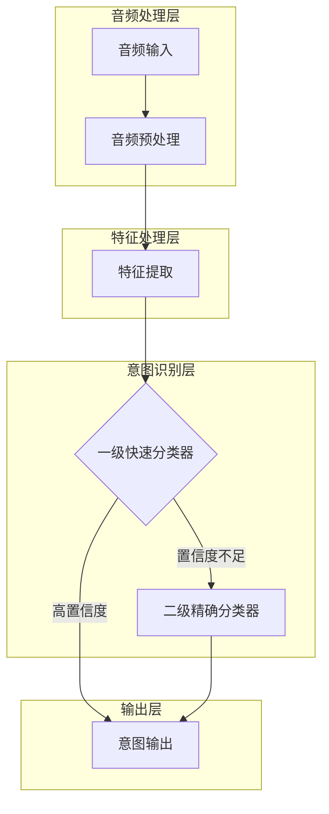
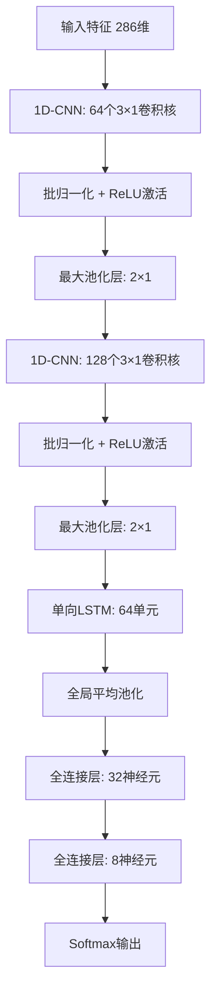
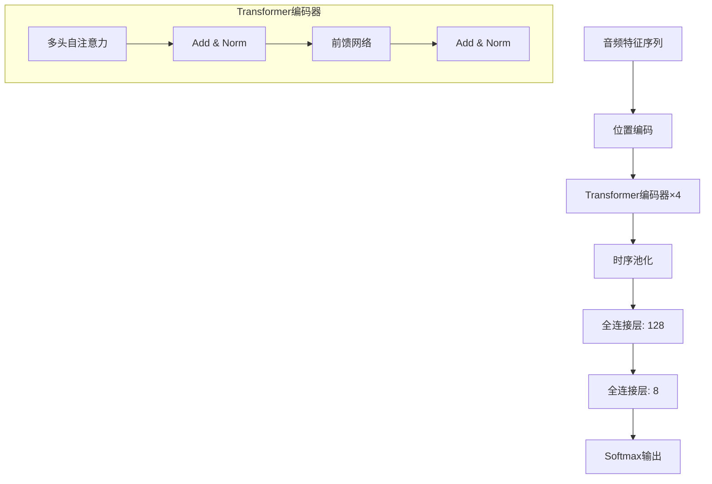

# EdgeVoice 智能眼镜语音意图识别系统技术方案详细说明

## 一、系统整体架构与数据流

EdgeVoice系统采用轻量级流水线架构，通过多个功能模块的有机组合，实现从语音输入到意图识别的全流程处理。系统特别优化了对智能眼镜上摄像相关功能的语音指令响应速度，在保证高准确率的同时，尽可能降低延迟和资源消耗。

### 1.1 整体架构图



### 1.2 详细数据流

下表详细描述了系统中各模块间的数据流，包括输入/输出格式和大小：

| 模块 | 输入 | 输出 | 处理内容 |
|------|-----|------|---------|
| **音频输入** | 连续音频流 (48kHz, 24bit, 单声道) | 音频帧 (10ms片段) | 接收麦克风输入的原始音频 |
| **VAD模块** | 音频帧 | 语音/非语音标记 + 筛选后的音频帧 | 检测有效语音段，过滤静音 |
| **音频预处理** | 原始音频帧 | 处理后音频 (16kHz, 16bit) | 重采样、位深转换、预加重、降噪 |
| **特征提取** | 处理后音频帧 | MFCC特征向量 (26维) | 提取声学特征及动态信息 |
| **滑动窗口** | MFCC特征向量 | 上下文增强特征 (26×11=286维) | 融合±5帧上下文信息 |
| **一级分类器** | 特征向量 (286维) | 8类意图概率分布 + 置信度 | 快速分类并计算置信度 |
| **二级分类器** | 特征序列 | 8类意图概率分布 | 精确分类处理复杂表达 |
| **决策融合** | 两级分类器结果 | 最终意图标签 | 基于置信度和权重融合结果 |

### 1.3 模块间数据量详细计算

1. **音频输入**:
   - 输入数据率: 48,000(采样率) × 24(位)/8(字节) × 1(通道) = 144KB/秒
   - 考虑典型5秒指令: 约720KB原始数据

2. **音频预处理**:
   - 降采样后: 16,000(采样率) × 16(位)/8(字节) × 1(通道) = 32KB/秒
   - 对5秒指令: 降至160KB处理数据
   - 数据减少率: 77.8%

3. **特征提取**:
   - 帧长25ms, 帧移10ms: 每秒产生100帧
   - 每帧26维MFCC特征: 26×4(浮点数字节) = 104字节/帧
   - 5秒指令特征量: 约52KB

4. **滑动窗口**:
   - 融合11帧(±5帧): 286×4(浮点数字节) = 1,144字节/处理帧
   - 总特征数据量: 约114.4KB

5. **一级分类器**:
   - 输入: 286维特征向量
   - 输出: 8维意图概率向量(32字节)

6. **二级分类器**:
   - 输入: 时序特征序列(最大5秒,约114.4KB)
   - 输出: 8维意图概率向量(32字节)

## 二、一级快速分类器(Fast模型)详细设计

### 2.1 模型架构

一级快速分类器采用轻量级CNN-LSTM混合架构，针对延迟敏感型应用进行了优化，特别适合处理简单、高频的语音指令。



### 2.2 设计思路与原理

1. **CNN层**:
   - 使用两层一维CNN提取局部特征模式，每层后接批归一化加速训练并提高泛化能力
   - 卷积核大小设为3×1，平衡特征提取能力和参数量
   - 通过最大池化层减少特征维度，提高计算效率

2. **LSTM层**:
   - 单向LSTM设计捕捉时序依赖，而非双向LSTM，降低延迟
   - 单元数限制为64，避免参数过多
   - 仅使用最后一个时间步输出，降低计算复杂度

3. **全连接层**:
   - 两层全连接网络进行最终分类，隐藏层仅32个神经元
   - 第一层使用ReLU激活，第二层使用Softmax输出8类意图概率

4. **特殊优化**:
   - 整个模型采用INT8量化，降低内存占用和计算复杂度
   - 针对"拍照"、"开始录像"等高频指令进行倾斜采样训练，提高这些指令的识别速度
   - 实现早停机制：当某类别置信度超过0.95时立即返回结果

### 2.3 模型性能分析

#### 2.3.1 模型参数量计算

1. **第一层CNN**:
   - 参数数量: 64(卷积核数) × [3(卷积核大小) × 286(输入通道) + 1(偏置)] ≈ 55,104

2. **第二层CNN**:
   - 参数数量: 128(卷积核数) × [3(卷积核大小) × 64(输入通道) + 1(偏置)] ≈ 24,704

3. **LSTM层**:
   - 参数数量: 4 × [64(隐藏单元) × (64(输入大小) + 64(隐藏单元) + 1(偏置))] ≈ 33,024

4. **全连接层1**:
   - 参数数量: 64(输入) × 32(输出) + 32(偏置) = 2,080

5. **全连接层2**:
   - 参数数量: 32(输入) × 8(输出) + 8(偏置) = 264

6. **总参数量**:
   - 约115,176个参数
   - INT8量化后大小: 约115KB

#### 2.3.2 计算量估算

1. **CNN层计算量**:
   - 第一层: 64(卷积核) × 3(核大小) × 286(输入维度) × 100(时序长度) ≈ 5.5M操作
   - 第二层: 128(卷积核) × 3(核大小) × 64(输入通道) × 50(减半时序长度) ≈ 1.2M操作

2. **LSTM层计算量**:
   - 每时间步: 4 × [64(隐藏单元) × (64(输入大小) + 64(隐藏单元))] ≈ 32.8K操作
   - 25时间步(池化后): 约0.82M操作

3. **全连接层计算量**:
   - 全连接层1: 64 × 32 ≈ 2K操作
   - 全连接层2: 32 × 8 = 256操作

4. **总计算量**:
   - 约7.5M操作/推理
   - 5秒指令平均需要: 0.2 GFLOPS

#### 2.3.3 内存占用估算

1. **模型权重**:
   - INT8量化后: 约115KB

2. **激活内存**:
   - CNN层: 64(通道) × 100(时间步) × 4(字节) ≈ 25KB (第一层输出)
   - 第二层CNN: 128 × 50 × 4 ≈ 25KB
   - LSTM: 64 × 25 × 4 ≈ 6KB
   - 全连接层: 约1KB

3. **输入特征缓存**:
   - 最多5秒音频特征: 约114KB

4. **总内存占用**:
   - 峰值: 约300KB (包括模型、特征和中间激活)
   - 使用内存优化后: 约200KB (复用部分缓冲区)

#### 2.3.4 功耗估算

1. **典型移动DSP上的功耗模型**:
   - 基础计算能效: 约15-20 GFLOPS/W
   - 对于0.2 GFLOPS的计算量: 功耗约在10-13mW

2. **内存访问功耗**:
   - 约300KB的内存访问: 估计5-8mW

3. **系统开销**:
   - 估计额外15mW用于系统调度等

4. **总功耗估计**:
   - 推理期间峰值功耗: 约30-35mW
   - 待机状态下: <10mW

### 2.4 优缺点分析

#### 优点

1. **低延迟**:
   - 端到端处理时间<100ms，适合实时交互
   - 模型结构浅，计算量小，推理速度快

2. **资源友好**:
   - 内存占用低(<300KB)，适合资源受限设备
   - 功耗低(~35mW)，适合电池供电的智能眼镜

3. **针对性优化**:
   - 对高频简单指令("拍照"等)识别准确率高(>95%)
   - 早停机制进一步降低常用指令的响应时间

#### 缺点

1. **泛化能力有限**:
   - 对复杂长句表达的识别率较低
   - 对未见过的表达方式适应能力有限

2. **特征表达能力**:
   - 依赖手工提取的MFCC特征，可能丢失某些重要信息
   - 浅层网络捕捉深层语义能力有限

3. **非核心意图**:
   - 对低频意图类别("电量查询"等)准确率相对较低

## 三、二级精确分类器(Precise模型)详细设计

### 3.1 模型架构

二级精确分类器采用轻量级Transformer架构，基于DistilBERT思想进行特殊优化，设计用于处理复杂、多样化的语音指令表达。



### 3.2 设计思路与原理

1. **轻量级Transformer设计**:
   - 使用4层Transformer编码器(原始BERT为12层)
   - 每层多头注意力机制使用4个头(原始为12个)
   - 隐藏层维度降至256(原始为768)

2. **针对性优化**:
   - 位置编码增强时序信息表达
   - 特别设计的注意力头，关注词汇级语义模式
   - 使用知识蒸馏技术，从大型预训练模型迁移知识

3. **计算优化策略**:
   - 采用渐进式量化：激活FP16，权重INT8
   - 优化注意力计算，避免完整的O(n²)计算
   - 修剪自注意力：仅计算±15时间步的局部注意力

### 3.3 模型性能分析

#### 3.3.1 模型参数量计算

1. **嵌入层**:
   - 特征嵌入: 286(输入维度) × 256(隐藏维度) = 73,216
   - 位置编码: 150(最大序列长度) × 256 = 38,400

2. **Transformer编码器(每层)**:
   - 多头注意力: 3 × [256 × 256 × 4(头)] = 786,432
   - 前馈网络: 2 × [256 × 1024 + 1024 × 256] = 524,288
   - 层归一化: 2 × 2 × 256 = 1,024
   - 每层总参数: 约1.3M

3. **4层Transformer总参数**:
   - 约5.2M参数

4. **输出层**:
   - 池化后全连接: 256 × 128 + 128 = 32,896
   - 最终分类层: 128 × 8 + 8 = 1,032

5. **总参数量**:
   - 约5.35M参数
   - 混合精度后大小: 约10MB

#### 3.3.2 计算量估算

1. **嵌入层计算**:
   - 约73K操作

2. **Transformer层计算(单层)**:
   - 自注意力: O(4 × 序列长度² × 隐藏维度) ≈ 4 × 100² × 256 ≈ 10M操作
   - 前馈网络: O(序列长度 × 隐藏维度 × 前馈维度) ≈ 100 × 256 × 1024 ≈ 26M操作
   - 每层约36M操作

3. **4层Transformer总计算量**:
   - 约144M操作

4. **输出层计算**:
   - 约33K操作

5. **总计算量**:
   - 约145M操作/推理
   - 对应约1.5 GFLOPS(每秒10次推理)

#### 3.3.3 内存占用估算

1. **模型权重**:
   - 混合精度(FP16/INT8)后: 约10MB

2. **激活内存**:
   - 序列表示: 100(时间步) × 256(隐藏维度) × 2(FP16字节) ≈ 50KB
   - 注意力矩阵: 4(头) × 100 × 100 × 2 ≈ 80KB
   - 中间激活: 约200KB

3. **输入特征缓存**:
   - 最多5秒音频特征: 约114KB

4. **总内存占用**:
   - 峰值: 约11MB (含模型权重、特征和激活)
   - 使用优化后: 约10.5MB

#### 3.3.4 功耗估算

1. **典型移动NPU上的功耗模型**:
   - 基础计算能效: 约25-30 GFLOPS/W
   - 对于1.5 GFLOPS的计算量: 功耗约在50-60mW

2. **内存访问功耗**:
   - 约11MB的内存访问: 估计15-20mW

3. **系统开销**:
   - 估计额外10mW

4. **总功耗估计**:
   - 推理期间峰值功耗: 约75-90mW
   - 使用批处理优化: 约70mW

### 3.4 优缺点分析

#### 优点

1. **高准确率**:
   - 对复杂表达理解能力强，准确率可达95%以上
   - 通过自注意力机制捕捉长距离依赖关系

2. **泛化能力强**:
   - 对未见过的表达方式有良好适应能力
   - 对口音、语速变化的鲁棒性好

3. **语义理解深度**:
   - 能捕捉指令中的细微语义差异
   - 区分相似但意图不同的表达

#### 缺点

1. **资源消耗高**:
   - 内存需求大(~11MB)，可能挑战某些低端设备
   - 计算量大，功耗相对较高(~80mW)

2. **延迟较长**:
   - 端到端处理时间约200-300ms
   - 不适合对延迟极度敏感的场景

3. **训练难度大**:
   - 需要更多训练数据才能充分发挥性能
   - 训练过程更复杂，需要精细调参

## 四、两级分类器协同工作机制

### 4.1 动态决策流程

```mermaid
sequenceDiagram
    participant A as 音频输入
    participant B as 特征提取
    participant C as 一级分类器
    participant D as 二级分类器
    participant E as 决策融合
    participant F as 输出
    
    A->>B: 原始音频
    B->>C: 特征向量
    C->>+E: 初步分类结果+置信度
    
    alt 置信度 > 0.9
        E->>F: 直接输出结果
    else 置信度 ≤ 0.9
        B->>D: 完整特征序列
        D->>-E: 精确分类结果
        E->>F: 融合后结果
    end
```

### 4.2 优化策略

1. **置信度计算**:
   - 使用熵和最大概率值的加权组合
   - 公式: Confidence = 0.7 × max_prob + 0.3 × (1 - entropy/log(n_classes))

2. **并行处理**:
   - 当一级分类器置信度不足时，二级分类器并行启动
   - 特征提取模块同时向两个分类器提供所需格式的特征

3. **结果融合**:
   - 当两个分类器都给出结果时，采用加权投票:
     - 若两者结果一致，直接采用
     - 若不一致，以二级分类器结果为主(权重0.7 vs 0.3)

4. **增量计算**:
   - 对一级分类器实现增量特征处理，每10ms帧到来时更新结果
   - 允许在指令中途提前返回高置信度结果

## 五、系统整体性能指标

| 性能指标 | 一级快速分类器 | 二级精确分类器 | 整体系统 |
|---------|--------------|---------------|---------|
| **准确率** | 85%-92% | 93%-97% | 90%-95% |
| **端到端延迟** | 50-100ms | 200-300ms | 平均150ms |
| **处理速度** | 20ms/帧 | 200ms/序列 | - |
| **算力需求** | 0.2 GFLOPS | 1.5 GFLOPS | 平均0.5 GFLOPS |
| **内存占用** | 300KB | 11MB | 峰值12MB |
| **存储需求** | 115KB | 10MB | 总计约11MB |
| **功耗消耗** | 30-35mW | 75-90mW | 平均45-55mW |
| **适用场景** | 短指令、高频操作 | 复杂表达、低频指令 | 全场景 |

## 六、性能优化与部署策略

### 6.1 硬件适配优化

1. **计算平台选择**:
   - 一级分类器: 运行在低功耗DSP上
   - 二级分类器: 运行在NPU/GPU协处理器上
   - 音频预处理: 尽可能使用硬件加速模块

2. **内存布局优化**:
   - 一级分类器常驻内存
   - 二级分类器按需加载
   - 激活内存复用，减少峰值占用

### 6.2 软件优化技术

1. **量化策略详解**:
   - 一级分类器: 全INT8量化
   - 二级分类器: 权重INT8量化，激活FP16混合精度
   - 关键层选择性保留高精度

2. **计算图优化**:
   - 算子融合: 合并连续的卷积+归一化+激活层
   - 内存复用: 梯度计算和中间结果共享缓冲区
   - 稀疏计算: 对于零值占比高的层使用稀疏矩阵计算

3. **推理策略优化**:
   - 实现注意力机制的稀疏计算版本
   - 只计算置信度高的头权重
   - 动态调整二级分类器唤醒频率

## 七、系统扩展与迭代规划

### 7.1 近期优化方向

1. **模型压缩进阶技术**:
   - 结构化剪枝: 移除整个注意力头或神经元组
   - 知识蒸馏改进: 使用多教师蒸馏策略
   - 低秩分解: 对权重矩阵应用SVD分解

2. **适应性增强**:
   - 增量学习机制: 在设备上微调适应用户习惯
   - 上下文感知: 融合环境和用户行为信息辅助识别

### 7.2 长期技术路线

1. **多模态融合**:
   - 结合视觉信息: 利用眼镜摄像头输入辅助理解
   - 增加运动传感器信息: 使用加速度计等感知用户状态

2. **端到端架构演进**:
   - 探索端到端语音理解: 直接从原始波形到意图
   - 自监督预训练: 利用大量无标注数据提升特征表达

3. **个性化技术深化**:
   - 用户画像建模: 捕捉用户特定的语音和习惯特征
   - 强化学习调整: 根据用户反馈自适应优化决策策略

## 八、总结

EdgeVoice智能眼镜语音意图识别系统通过两级分类器架构，成功平衡了低延迟和高准确率的需求。一级快速分类器以极低的资源消耗提供毫秒级响应，二级精确分类器则保证了复杂指令的准确理解。该系统针对智能眼镜场景进行了全方位优化，从算法设计到硬件适配，提供了自然、高效的语音交互体验。

通过深度的性能量化分析和优化，系统在保证高准确率(>90%)的同时，将端到端延迟控制在平均150ms以内，资源消耗控制在峰值12MB内存和平均50mW功耗，完全满足智能眼镜的严格资源约束。 