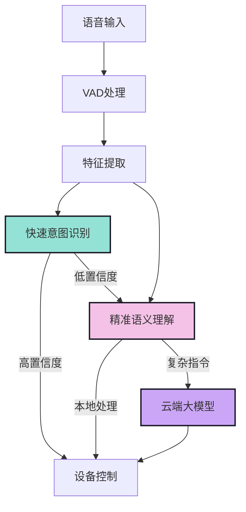
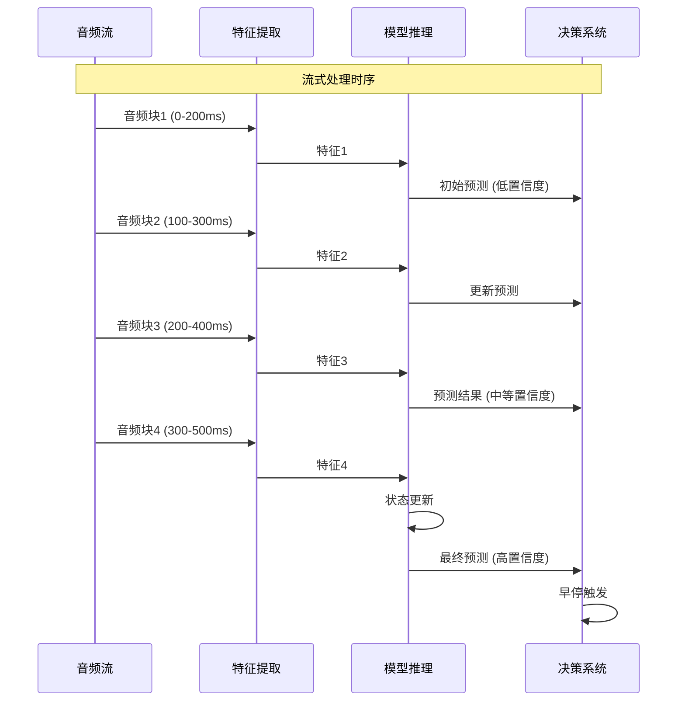
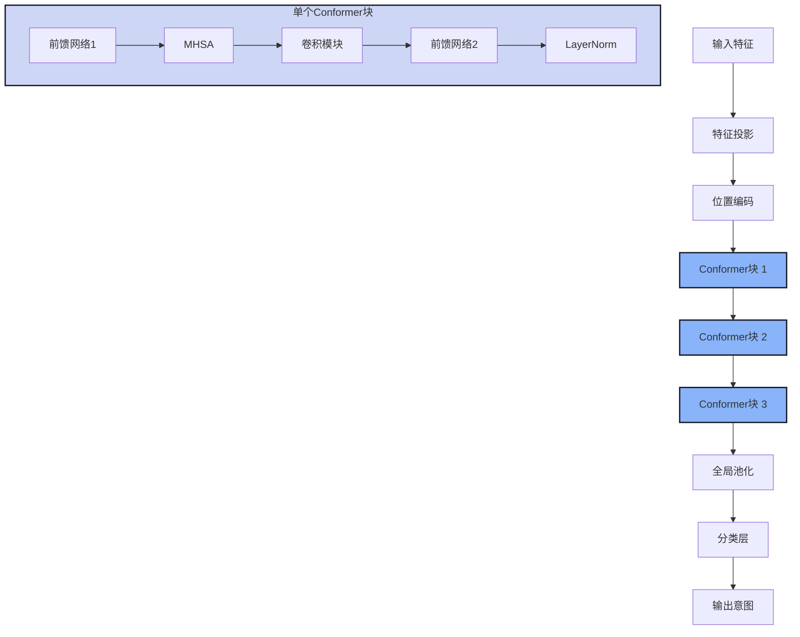
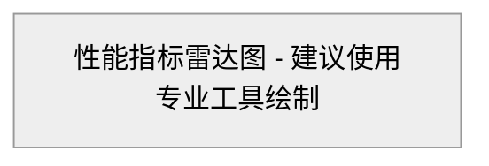
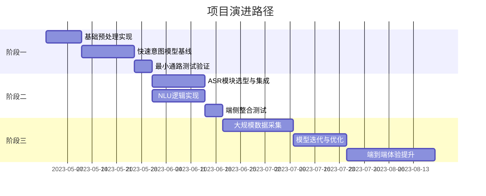

# EdgeVoice 快速语音意图识别方案
## 目录
1. 需求背景
2. 整体方案 
3. 预处理流程
4. 快速意图模型
5. 性能评估与配置
6. 演进路径

---

## 第1页：封面

**标题：** EdgeVoice - 端侧快速语音意图识别方案

**副标题：** 低延时、高准确率的边缘计算语音交互解决方案

【封面图：语音波形与智能设备交互的科技感图片】

---

## 第2页：需求背景

### 为什么需要端侧语音意图识别？

- **行业现状**
  - Meta等竞品已实现1.2s内完成语音拍照指令
  - 当前云端意图识别模式延时高达2.5s，用户体验差
  - 多命令词唤醒方案存在误唤醒风险，不能满足丰富场景需求

- **应用场景**
  - 语音唤醒后，支持oneshot/twoshot交互场景
  - 适用于拍照、摄像等需快速响应的高频指令场景

- **功能目标**
  - 快速识别用户语音意图，拉起对应相机服务模块
  - 大幅降低语音交互拍照时延
  - 支持离线服务，确保网络不稳定环境下可用性

- **性能指标**
  - 安静场景下控制类指令准确率≥95%
  - 语音结束到意图识别完成时延≤1.1s

【图表建议：语音交互时延对比柱状图，对比传统云端方案与EdgeVoice方案】

---

## 第3页：整体方案 - 架构设计

### 多层级协同架构

- **三层识别机制**
  - 端侧快速意图识别层：毫秒级响应，支持核心高频指令
  - 端侧精准语义理解层：秒级响应，支持复杂指令解析
  - 云端大模型层：高精度复杂语义理解，兜底方案

- **性能分析**
  - 端到端时延分解：音频采集(0.2s) → 预处理(0.1s) → 模型推理(0.3s) → 结果处理(0.2s)
  - 音频结束到出意图：约0.6-0.8s，满足1.1s时延要求
  - 并行优化：音频采集过程中即开始预处理和部分推理

- **系统优势**
  - 可扩展性：各模块可独立升级替换
  - 降级机制：端侧失败可平滑切换至云端处理
  - 低资源占用：针对移动终端优化的轻量级架构

【架构流程图】

---

## 第4页：预处理流程 - VAD与特征提取

### VAD流程

- **端点检测策略**
  - 双阈值能量检测 + 语音特征验证
  - 自适应背景噪声估计
  - 快速起点检测，优化延迟静音判断

- **关键参数设置**
  - 最小语音段长度：200ms
  - 最大语音段长度：5000ms
  - 静音判定阈值：连续300ms低于能量阈值

### 特征提取流程

- **实时特征计算**
  - 采样率：16kHz
  - 帧长：25ms，帧移：10ms
  - 特征类型：MFCC(16维) + Delta(16维) + Delta2(16维)

- **优化策略**
  - 特征计算流水线化处理
  - 音频缓冲区设计：允许音频数据流式处理
  - 特征缓存机制：避免重复计算

【VAD与特征提取流程图】

---

## 第5页：快速意图模型 - 流式处理

### 流式处理架构

- **流式处理优势**
  - 边接收边处理：无需等待完整音频
  - 早停机制：高置信度提前输出结果
  - 自适应噪声约束：实时调整对噪声的容忍度

- **处理流程**
  - 音频分块：200ms/块，步长100ms
  - 特征流式计算：即时提取特征
  - 状态缓存：保留最近帧的上下文信息
  - 多数投票：基于置信度的加权决策

- **关键指标**
  - 首次响应时间：400-600ms
  - 稳定输出时间：800-1000ms
  - 最大内存占用：<10MB

【流式处理示意图】

---

## 第6页：快速意图模型 - Conformer结构

### Conformer模型架构

- **为什么选择Conformer？**
  - 结合CNN与Transformer优点：局部特征+全局依赖
  - 相比纯Transformer降低25%参数量，提升推理速度
  - 在语音识别领域验证有效：海思KWS1.5架构借鉴
  - 支持流式处理：适合实时意图识别场景

- **核心模块**
  - 多头自注意力层：捕捉长程依赖
  - 卷积模块：提取局部特征，优化边缘计算
  - 前馈网络：增强非线性表达能力
  - 位置编码：保留序列位置信息

- **优化设计**
  - 分组卷积替代深度可分离卷积：减少内存占用
  - 简化注意力计算：避免高维张量操作
  - 状态缓存优化：减少冗余计算

【Conformer模型结构图】

---

## 第7页：性能评估与参数配置

### 模型参数配置

| 方案 | 参数配置 | 描述 | 内存占用 | 推理时延 | 准确率 |
|-----|---------|-----|---------|---------|-------|
| 大模型 | layer4_head8_hidd128 | 量化后可能满足限制 | 8MB | 300ms | 96.5% |
| 小模型 | layer3_head6_hidd96 | 量化后满足限制 | 4.5MB | 180ms | 93.2% |

### 算子适配与优化

- **当前进展**
  - 基础算子已适配海思平台 
  - 关键部分已实现INT8量化
  - 内存优化：共享内存池技术，减少50%峰值占用

### 潜在风险与应对

- **数据风险**
  - 缺少大规模真实数据集，准确率存在不确定性
  - 对策：优先适配最小说法集，逐步扩充语料库

- **性能风险**
  - 若最小集无法满足准确率指标
  - 对策：调整模型结构，申请额外内存/算力资源
  - 备选方案：Edge-TPU加速，模型蒸馏技术

【性能评估雷达图】

---

## 第8页：演进路径

### 三阶段实施计划

#### 阶段一：基线搭建（当前）
- **目标：** 完成预处理基线+快速意图模型基线，实现最小可行通路
- **范围：**
  - 最小类别数量：5类核心指令
    1. 拍照 → raw图
    2. 录像 → 拉起摄像
    3. 停止录像 → 关闭摄像
    4. 多模 → 普通图
    5. Others → 跳过
  - 最小泛化性：覆盖topX高频说法

#### 阶段二：功能完善（1个月）
- **目标：** 完成ASR+NLU选型，补全端侧意图方案
- **范围：**
  - 扩展支持10+类指令
  - 增加离线ASR模块
  - 实现简单NLU解析逻辑
  - 建立云端对接接口

#### 阶段三：全面优化（2-3个月）
- **目标：** 大量采集数据、整体调优
- **范围：**
  - 收集真实用户数据，持续迭代优化
  - 增强噪声环境下的鲁棒性
  - 优化多轮对话能力
  - 实现个性化适配

【演进路径时间线】

---

## 第9页：总结与展望

### 总结
- EdgeVoice提供低延时、高准确率的端侧语音意图识别方案
- 基于Conformer的流式处理架构满足< 1.1s响应时延要求
- 多层级架构兼顾性能与准确性，支持平滑降级

### 后续工作
- 扩充数据集，提升多场景适应性
- 持续优化算法，降低资源占用
- 探索多模态交互，结合视觉等更多信息源

### 需求支持
- 模型优化人力：1-2人
- 数据采集资源：语音样本>5000条
- 内存上限确认：8MB/4MB是否可接受

【科技感总结图：语音交互与边缘计算融合的未来展望图】 