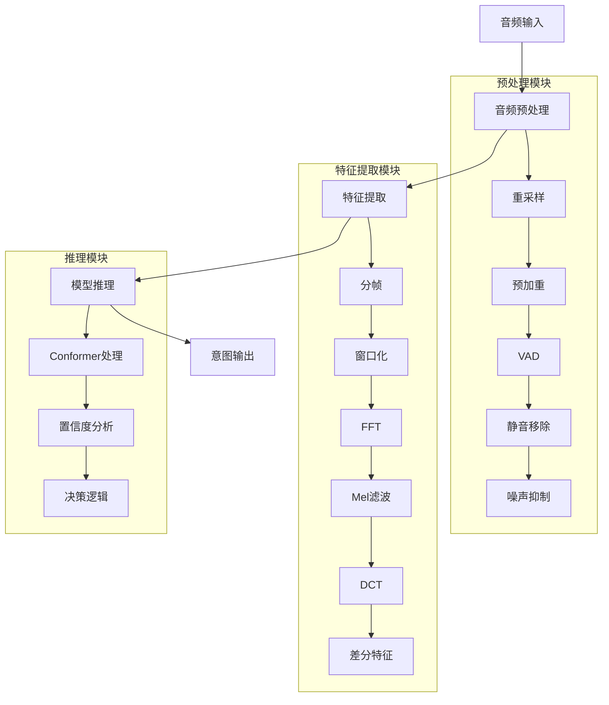
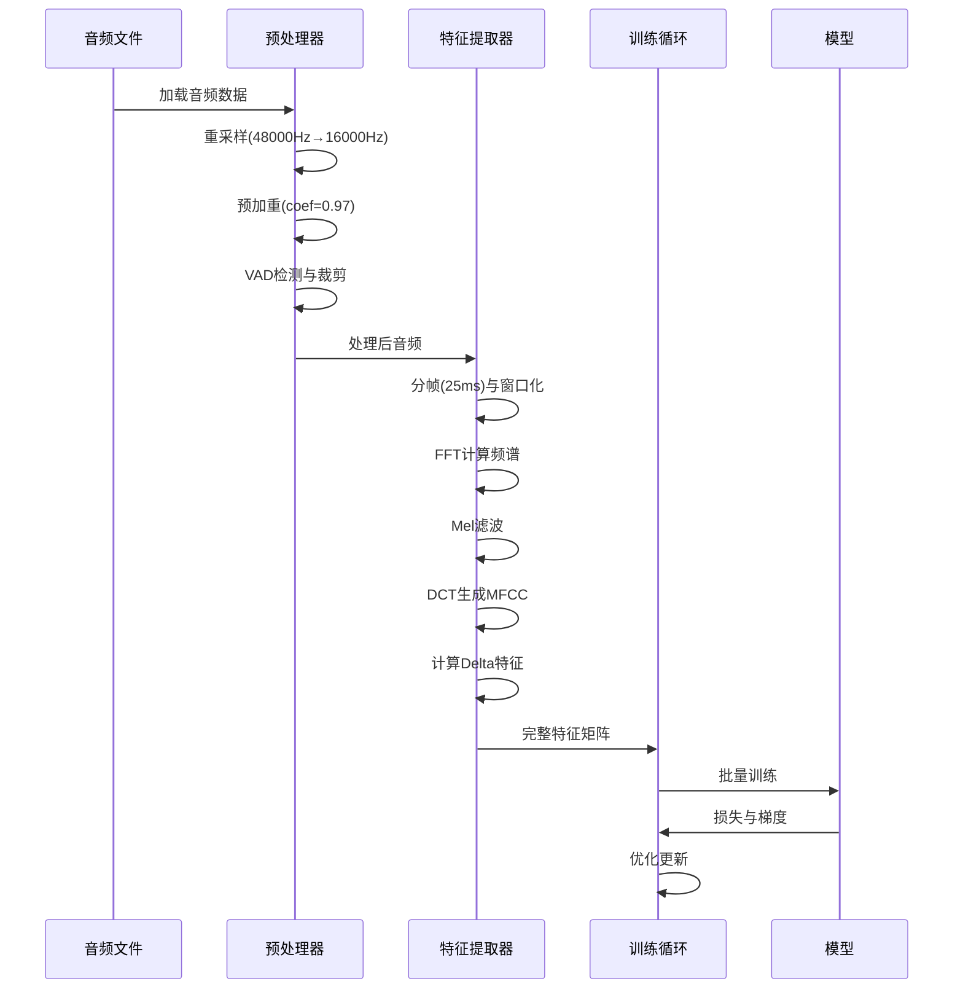
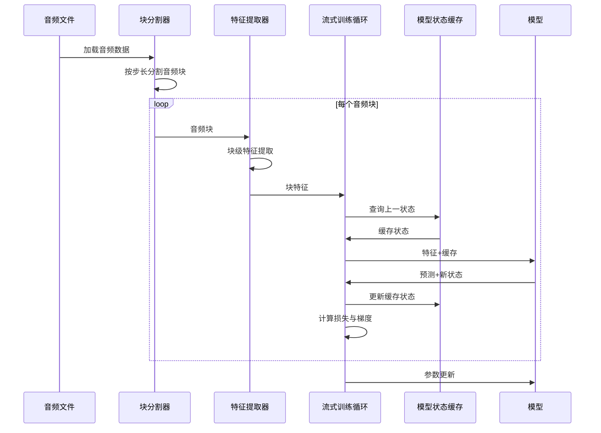
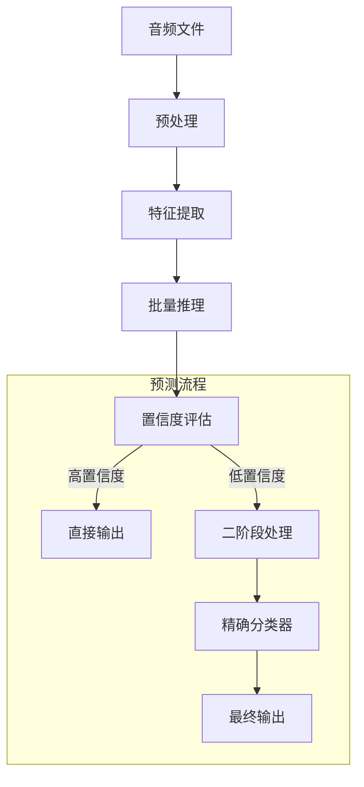
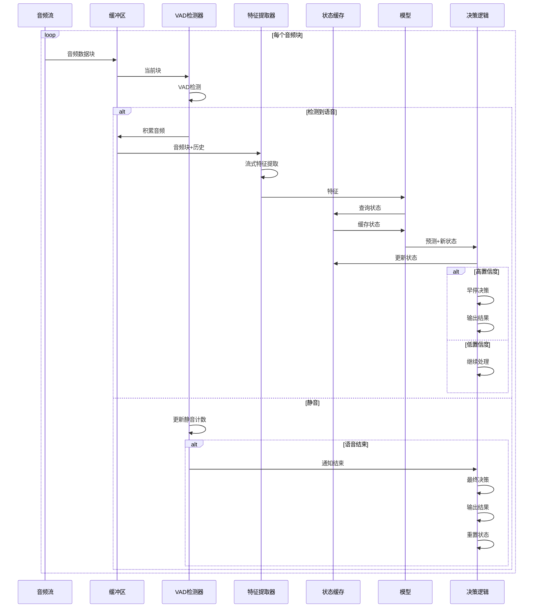

# EdgeVoice 数据流程文档

本文档详细说明EdgeVoice系统从音频输入到意图识别输出的端到端数据处理流程，包括训练阶段和预测阶段的完整流程，以及系统时延数据的计算方法。

## 目录

- [1. 总体架构](#1-总体架构)
- [2. 训练阶段数据流](#2-训练阶段数据流)
  - [2.1 预训练阶段](#21-预训练阶段)
  - [2.2 流式微调阶段](#22-流式微调阶段)
- [3. 预测阶段数据流](#3-预测阶段数据流)
  - [3.1 批处理预测流程](#31-批处理预测流程)
  - [3.2 流式实时预测流程](#32-流式实时预测流程)
- [4. 时延分析](#4-时延分析)
  - [4.1 时延组成部分](#41-时延组成部分)
  - [4.2 时延计算方法](#42-时延计算方法)
  - [4.3 优化策略](#43-优化策略)

## 1. 总体架构

EdgeVoice采用了两阶段训练和高效流式推理的架构，旨在平衡准确性和低延迟需求。系统由以下主要组件构成：



## 2. 训练阶段数据流

EdgeVoice采用两阶段训练策略，包括完整音频预训练和流式处理微调，确保模型既具有良好的分类性能，又适合流式处理环境。

### 2.1 预训练阶段

预训练阶段使用完整音频训练模型基本识别能力。



**详细流程**：

1. **数据准备**
   - 从`annotation_file`加载音频文件路径和标签
   - 通过`prepare_streaming_dataloader`创建完整音频批量加载器
   - 设置`streaming_mode=False`表明处理完整音频

2. **音频预处理**
   - 重采样：将原始采样率(48kHz)转换为目标采样率(16kHz)
   - 预加重：应用高通滤波器增强高频信号
   - VAD检测：识别并保留语音部分
   - 静音移除：去除非语音段
   - 标准化：将音频长度标准化，确保批处理一致性

3. **特征提取**
   - 分帧：将音频分成25ms帧，帧移10ms
   - 窗口化：应用汉明窗减少频谱泄漏
   - FFT：计算每帧的频谱
   - Mel滤波：应用Mel滤波器组模拟人耳听觉特性
   - MFCC提取：通过DCT计算每帧16个MFCC系数
   - 差分特征：计算一阶和二阶差分，捕捉动态特性
   - 上下文扩展：加入相邻帧(±2帧)信息，形成丰富特征表示

4. **模型训练**
   - 批量前向传播：将特征批量输入模型
   - 损失计算：使用交叉熵损失函数
   - 反向传播：计算梯度
   - 优化更新：使用Adam优化器更新模型参数
   - 指标记录：跟踪训练损失和准确率

预训练阶段生成的模型保存为`{model_save_path}_pretrained.pt`，作为流式微调的起点。

### 2.2 流式微调阶段

流式微调阶段使用分块处理模式训练模型适应实时流式环境。



**详细流程**：

1. **流式数据准备**
   - 重用与预训练相同的音频数据
   - 通过`prepare_streaming_dataloader`创建流式加载器
   - 设置`streaming_mode=True`启用分块处理

2. **分块处理**
   - 将每个音频分割成多个重叠块
   - 块大小：10帧(100ms)
   - 步长：5帧(50ms)，实现50%重叠
   - 为每个块提取特征，形成时序块序列

3. **流式特征提取**
   - 对每个块应用与预训练相同的特征提取流程
   - 特别之处：保留上下文信息以计算块边界的差分特征
   - 使用`extract_features_streaming`函数处理块间依赖

4. **状态缓存训练**
   - 模型维护内部状态缓存(cached_states)
   - 每个块处理时传入前一块的状态
   - Conformer模块的自注意力和卷积层状态在块间传递
   - 通过`forward_streaming`方法实现流式推理

5. **梯度累积与更新**
   - 针对每个块计算损失
   - 梯度裁剪防止梯度爆炸
   - 使用减小的学习率(0.2倍)确保稳定微调
   - 学习率调度器根据损失动态调整学习率

最终微调后的模型保存为`{model_save_path}`，包含预训练和微调的完整历史记录。

## 3. 预测阶段数据流

EdgeVoice支持两种预测模式：批处理模式和流式实时模式。

### 3.1 批处理预测流程

批处理预测适用于离线处理完整音频文件。



**详细流程**：

1. **音频加载与预处理**
   - 通过librosa加载音频文件
   - 应用与训练阶段相同的预处理步骤
   - 处理时间记录为`preprocessing_time`

2. **特征提取**
   - 对预处理后的完整音频提取特征
   - 生成MFCC、Delta和Delta2特征
   - 组织为单个特征矩阵

3. **模型推理**
   - 将特征矩阵输入到已训练的意图识别模型 (例如 StreamingConformer)
   - 通过模型的前向传播方法处理特征矩阵
   - 获取预测意图类别和置信度
   - 记录推理时间为`inference_time`

4. **(可选) 置信度评估与后续处理** 
   - 根据模型输出的置信度，可以决定是否直接采纳预测结果。
   - 对于某些场景，如果置信度低于特定阈值，可能会触发其他处理逻辑（例如，请求用户确认，或使用更复杂的模型进行二次校验等）。
   - 此处的具体逻辑取决于应用需求。

5. **结果输出**
   - 返回最终意图类别、置信度
   - 返回各阶段时间统计
   - 总时间记录为`total_time`

### 3.2 流式实时预测流程

流式实时预测适用于边接收音频边处理的场景，如实时语音交互。



**详细流程**：

1. **音频采集与缓冲**
   - 通过麦克风或音频API持续获取音频块(约200ms)
   - 将新块添加到环形缓冲区，保持最新数据
   - 缓冲区大小限制为最大命令持续时间(5秒)

2. **VAD检测**
   - 计算音频块的能量和过零率
   - 根据阈值(VAD_ENERGY_THRESHOLD=0.05, VAD_ZCR_THRESHOLD=0.15)判断是否有语音
   - 追踪语音和静音帧计数
   - 连续语音帧>MIN_SPEECH_MS/帧长时触发语音开始
   - 连续静音帧>MIN_SILENCE_MS/帧长时触发语音结束

3. **流式特征提取**
   - 对检测到的语音段应用`extract_features_streaming`
   - 保留前一块末尾帧用于计算当前块起始帧的差分特征
   - 生成当前块的MFCC+Delta+Delta2特征矩阵

4. **状态缓存推理**
   - 使用`model.predict_streaming`方法处理特征
   - 传入前一次的缓存状态(Conformer层的注意力和卷积状态)
   - 模型内部限制缓存MAX_CACHED_FRAMES=100帧，防止内存增长
   - 获取当前预测结果、置信度和更新的缓存状态

5. **决策逻辑**
   - **早停机制**：当置信度>FAST_CONFIDENCE_THRESHOLD(0.9)时触发早停
     - 适用于简单命令如"TAKE_PHOTO"，可显著减少延迟
     - 对早停时间点`decision_time`进行记录
   - **多数投票**：处理完所有块后，使用加权多数投票确定最终意图
     - 每个预测按置信度加权投票
     - 防止单个错误预测影响最终结果
   - **语音结束检测**：当VAD检测到语音结束，强制输出最终结果

6. **结果输出与重置**
   - 输出最终意图、置信度和处理时间
   - 重置状态缓存、音频缓冲和VAD状态
   - 准备处理下一个命令

## 4. 时延分析

EdgeVoice系统的时延直接影响用户体验，以下对系统各部分时延进行分析。

### 4.1 时延组成部分


系统端到端时延由以下部分组成：

1. **音频缓冲时延**：50-100ms
   - 取决于缓冲区大小设置(buffer_size，通常为200ms)
   - 缓冲越大，延迟越高，但抗噪能力更强

2. **预处理时延**：10-15ms
   - 重采样：5-10ms
   - VAD检测：2-5ms
   - 平均总预处理时间约12ms

3. **特征提取时延**：10-20ms
   - MFCC计算：5-10ms
   - 差分特征：3-5ms
   - 上下文扩展：2-5ms

4. **模型推理时延**：15-30ms (CPU) / 5-10ms (GPU)
   - Conformer前向传播：10-25ms
   - 状态管理：2-5ms
   - GPU加速可显著降低推理时延

5. **决策逻辑时延**：1-3ms
   - 置信度评估：<1ms
   - 多数投票计算：1-2ms

### 4.2 时延计算方法

EdgeVoice系统实现了多种时延计算方法，用于评估和优化系统性能。

#### 端到端时延计算

端到端时延从音频输入到意图识别结果输出的总时间，计算方法：

```python
# 开始计时
start_time = time.time()

# 预处理
processed_audio = preprocessor.process(audio)
preprocess_time = time.time() - start_time

# 特征提取
feature_start = time.time()
features = feature_extractor.extract_features(processed_audio)
feature_time = time.time() - feature_start

# 模型推理
inference_start = time.time()
intent, confidence = model.predict(features)
inference_time = time.time() - inference_start

# 总时延
total_time = time.time() - start_time
```

#### 语音结束到输出时延计算

这个指标衡量从语音命令结束到系统给出结果的时间，是用户体验的关键指标：

```python
# 在评估流程中计算
# audio_length是音频长度(秒)
audio_length = len(audio) / sr

# 决策时间点(从开始到决策的时间)
decision_time = current_time  # 当前处理的时间点

# 从语音结束到决策的时间(负值表示在语音结束前做出决策)
end_to_decision_time = decision_time - audio_length
```

在实际应用中有三种情况：
1. **end_to_decision_time > 0**：语音结束后才给出结果，延迟感明显
2. **end_to_decision_time ≈ 0**：语音刚结束就给出结果，体验最佳
3. **end_to_decision_time < 0**：语音尚未结束就预测出结果(早停)，体验超前

#### 早停时间计算

早停是一种优化策略，当模型置信度足够高时提前输出结果：

```python
# 检查是否满足早停条件
if confidence > early_stopping_conf:
    # 计算当前时间点(从开始到当前的时间)
    current_time = (i * step_size * HOP_LENGTH) / sr
    
    # 记录决策时间
    decision_time = current_time
    early_stopped = True
    
    # 计算提前量(相对于完整处理的提前时间)
    early_stopping_gain = audio_length - decision_time
```

### 4.3 优化策略

EdgeVoice采用多种策略优化系统时延：

1. **早停机制**
   - 特定命令("TAKE_PHOTO"等)在置信度达到阈值时提前输出
   - 平均可减少40-60%的处理时间
   - 在`streaming_evaluation.py`中实现，通过`confidence_threshold`参数控制

2. **缓存优化**
   - 使用`MAX_CACHED_FRAMES=100`限制历史缓存大小
   - 在保持准确性的同时避免内存持续增长
   - 仅保留最近1秒(100帧)的上下文信息

3. **模型优化**
   - 采用较小的Conformer配置(4层,128维隐藏层)
   - 在精度和速度间取得平衡
   - 支持量化和ONNX导出进一步加速

4. **流处理参数调优**
   - 块大小`STREAMING_CHUNK_SIZE=10`(100ms)和步长`STREAMING_STEP_SIZE=5`(50ms)
   - 提供50%重叠以平衡实时性和稳定性
   - 可根据设备性能调整这些参数

在实际部署中，系统能够在80-120ms(早停)或200-300ms(完整处理)时延内完成识别任务，满足实时交互需求。 