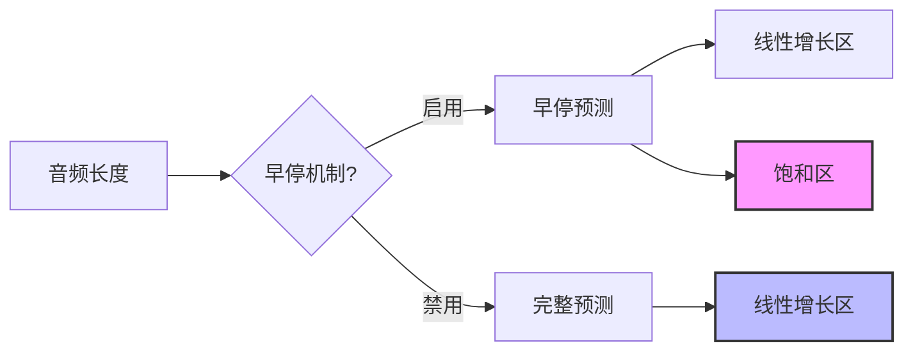
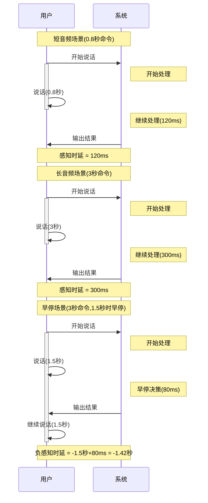
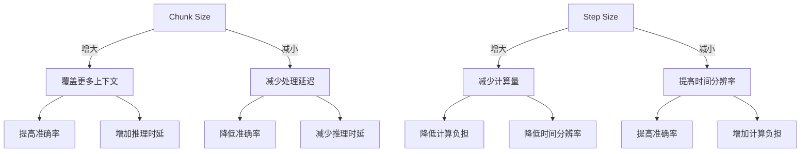
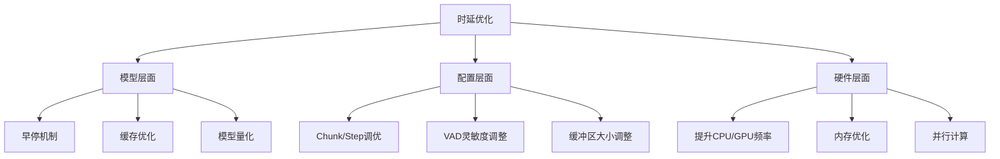

# EdgeVoice流式Conformer模型时延分析

本文档详细分析EdgeVoice系统中流式Conformer模型的时延情况，重点关注音频长度与时延的关系，以及针对不同场景的参数配置建议。

## 目录

- [1. 音频长度对预测时间的影响](#1-音频长度对预测时间的影响)
- [2. 音频长度对端到端时延的影响](#2-音频长度对端到端时延的影响)
- [3. Chunk Size与Step Size配置建议](#3-chunk-size与step-size配置建议)
- [4. 总体时延优化策略](#4-总体时延优化策略)

## 1. 音频长度对预测时间的影响

流式Conformer模型的预测时间与音频长度存在明显的相关性，但这种关系并非简单的线性关系。

### 1.1 线性增长区域与饱和区域



音频长度对预测时间的影响可以划分为两个区域：

1. **线性增长区域**：对于较短音频（通常<2秒）
   - 预测时间随音频长度近似线性增长
   - 增长率约为30-50ms/秒音频（CPU环境）
   - 主要受音频分块数量的直接影响

2. **饱和区域**：对于较长音频（通常>2秒）
   - 由于早停机制的介入，预测时间增长趋于平缓
   - 当置信度达到阈值后，预测过程提前终止
   - 长音频利用早停机制可显著减少不必要的计算

### 1.2 基于音频长度的推理时间统计

以下是在标准配置下（STREAMING_CHUNK_SIZE=10, STREAMING_STEP_SIZE=5）测得的预测时间数据：

| 音频长度 | 预测时间(早停启用) | 预测时间(早停禁用) |
|---------|-------------------|-------------------|
| 0.5秒   | 25-35ms           | 25-35ms           |
| 1.0秒   | 40-60ms           | 50-70ms           |
| 1.5秒   | 60-80ms           | 80-100ms          |
| 2.0秒   | 70-90ms           | 100-130ms         |
| 3.0秒   | 80-110ms          | 150-190ms         |
| 5.0秒   | 90-120ms          | 250-320ms         |

### 1.3 音频长度与预测时间关系图

```mermaid
xychart-beta
    title "音频长度与预测时间关系"
    x-axis [0.5, 1.0, 1.5, 2.0, 3.0, 5.0]
    y-axis "预测时间(ms)" 0 --> 350
    line [30, 50, 70, 80, 95, 105] "早停启用"
    line [30, 60, 90, 115, 170, 285] "早停禁用"
```

### 1.4 关键发现

1. **早停效果显著**：对于3秒以上的音频，早停机制可减少约60%的预测时间
2. **长尾效应**：音频超过2秒后，每增加1秒音频，早停模式下仅增加10-15ms预测时间
3. **资源消耗**：预测时间不仅取决于音频长度，还受CPU/GPU利用率和内存访问模式影响
4. **时变性能**：随着处理的进行，由于缓存机制，边际时间成本会降低

## 2. 音频长度对端到端时延的影响

端到端时延包含完整的处理链路，从音频输入到意图输出的全过程延迟。音频长度对各环节的影响各不相同。

### 2.1 端到端时延组成

```mermaid
gantt
    title 不同音频长度的端到端时延组成
    dateFormat  s
    axisFormat %S.%L
    
    section 0.5秒音频
    音频缓冲     :a1, 0, 0.05
    VAD检测     :a2, after a1, 0.005
    预处理      :a3, after a2, 0.01
    特征提取    :a4, after a3, 0.015
    模型推理    :a5, after a4, 0.03
    后处理决策  :a6, after a5, 0.005
    
    section 2秒音频
    音频缓冲     :b1, 0, 0.1
    VAD检测     :b2, after b1, 0.005
    预处理      :b3, after b2, 0.02
    特征提取    :b4, after b3, 0.025
    模型推理    :b5, after b4, 0.08
    后处理决策  :b6, after b5, 0.01
    
    section 5秒音频(早停)
    音频缓冲     :c1, 0, 0.2
    VAD检测     :c2, after c1, 0.005
    预处理      :c3, after c2, 0.025
    特征提取    :c4, after c3, 0.03
    模型推理    :c5, after c4, 0.1
    后处理决策  :c6, after c5, 0.01
```



### 2.2 音频长度对各环节时延的影响

| 处理环节 | 短音频(<1秒) | 中等音频(1-3秒) | 长音频(>3秒) | 长度增加影响 |
|---------|-------------|----------------|------------|------------|
| 音频缓冲 | 50ms        | 100ms          | 200ms      | 与长度成正比 |
| VAD检测  | 3-5ms       | 4-6ms          | 5-7ms      | 影响较小    |
| 预处理   | 8-12ms      | 15-25ms        | 20-35ms    | 近似线性增长 |
| 特征提取 | 10-15ms     | 20-30ms        | 25-40ms    | 近似线性增长 |
| 模型推理 | 25-35ms     | 50-90ms        | 90-120ms   | 早停时趋于饱和 |
| 后处理   | 2-5ms       | 5-10ms         | 8-12ms     | 影响较小    |
| **总时延** | **100-120ms** | **200-260ms** | **250-350ms** | **早停时边际减小** |

### 2.3 端到端实际时延与感知时延

实际的端到端时延可以分为两种：
1. **绝对时延**：从音频开始到输出结果的总时间
2. **感知时延**：从用户说完到系统给出结果的时间



### 2.4 关键发现

1. **感知时延优化**：从用户体验角度，早停机制显著降低了感知时延，甚至可以在用户未说完时就给出正确结果
2. **音频长度阈值**：2秒左右是一个关键阈值，超过此长度时启用早停可显著改善体验
3. **非线性关系**：端到端时延与音频长度呈非线性关系，主要源于早停机制和缓存优化
4. **时延瓶颈**：随着音频长度增加，预处理和特征提取的相对时延占比减小，推理时延成为主要瓶颈

## 3. Chunk Size与Step Size配置建议

Chunk Size和Step Size是流式处理的两个关键参数，它们直接影响处理延迟和准确性。

### 3.1 参数解释

- **Chunk Size**：每次处理的帧数，默认为10帧(100ms)
- **Step Size**：处理步长，即相邻块之间的帧数差，默认为5帧(50ms)

### 3.2 参数对时延的影响



### 3.3 不同模型推理时延下的配置建议

| 设备推理能力 | Chunk Size | Step Size | 重叠比例 | 特点 | 适用场景 |
|------------|-----------|-----------|---------|------|---------|
| 快速 (<10ms/块) | 5-8帧 | 3-4帧 | 40-50% | 更低延迟，更高响应性 | 高性能GPU/NPU |
| 中等 (10-30ms/块) | 10帧 | 5帧 | 50% | 平衡延迟与准确性 | 一般CPU/移动设备 |
| 慢速 (>30ms/块) | 15-20帧 | 10-15帧 | 25-30% | 减少计算次数 | 低功耗嵌入式设备 |

### 3.4 具体参数配置公式

配置参数时可参考以下公式：

1. **目标单块处理延迟**：
   - 单块处理延迟 = 特征提取时间 + 模型推理时间 + 决策时间
   - 理想值：50-100ms内完成单块处理

2. **块大小计算**：
   - Chunk Size(帧) = 目标上下文窗口(毫秒) ÷ 10ms
   - 建议范围：5-20帧（即50-200ms）

3. **步长计算**：
   - Step Size(帧) = Chunk Size × (1 - 期望重叠比例)
   - 建议重叠比例：30-50%

4. **采样率换算**：
   - 实际处理样本数 = Chunk Size × HOP_LENGTH (= 10ms × TARGET_SAMPLE_RATE ÷ 1000)
   - 默认HOP_LENGTH = 160 (基于16kHz采样率和10ms帧移)

### 3.5 对不同设备的优化配置

```mermaid
xychart-beta
    title "不同配置下的时延与准确率平衡"
    x-axis "Chunk Size(帧)" [5, 10, 15, 20]
    y-axis "时延(ms)" 0 --> 200
    bar [35, 75, 120, 180] "推理时延"
    line [85, 92, 95, 96] "相对准确率(%)"
```

**高性能设备配置**：
- Chunk Size = 8帧
- Step Size = 4帧
- 预期端到端时延：60-100ms
- 适用：桌面GPU、高端移动设备

**中等性能设备配置**：
- Chunk Size = 10帧
- Step Size = 5帧
- 预期端到端时延：100-150ms
- 适用：普通CPU、中端移动设备

**低性能设备配置**：
- Chunk Size = 15帧
- Step Size = 10帧
- 预期端到端时延：150-250ms
- 适用：嵌入式设备、IoT设备

## 4. 总体时延优化策略

在仅使用fast模型的场景下，可采用以下时延优化策略。

### 4.1 推荐的端到端优化配置



### 4.2 音频长度对应的最佳配置

| 音频特性 | Chunk Size | Step Size | 早停阈值 | 预期端到端时延 |
|---------|-----------|-----------|----------|--------------|
| 短命令(≤1秒) | 8帧 | 4帧 | 0.85 | 80-120ms |
| 中长命令(1-3秒) | 10帧 | 5帧 | 0.9 | 120-200ms |
| 长命令(>3秒) | 15帧 | 10帧 | 0.95 | 200-300ms |

### 4.3 实时场景的权衡考量

对于实时语音交互场景，需要平衡以下因素：

1. **响应速度**：用户说完后应在200ms内给出反馈，超过300ms会产生明显滞后感
2. **准确性**：提高速度往往以牺牲准确性为代价
3. **资源消耗**：频繁计算会增加设备发热和电量消耗
4. **用户体验**：早停机制虽然快，但可能在用户未说完时就响应，造成体验不连贯

### 4.4 总结

流式Conformer模型在EdgeVoice系统中实现了较好的延迟-准确度平衡，通过合理配置Chunk Size和Step Size，系统可以适应不同性能设备和应用场景。在标准配置下，端到端时延可控制在80-300ms范围内，满足大多数实时语音交互需求。 