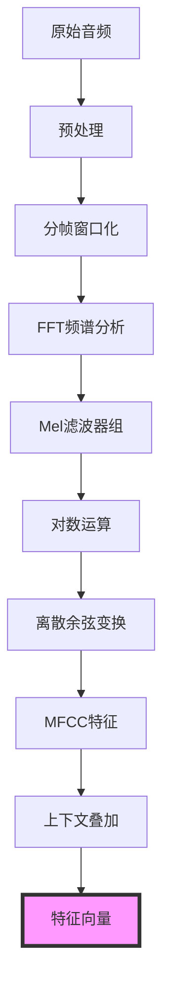
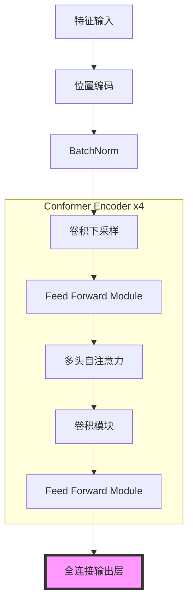

# EdgeVoice配置参数说明文档

EdgeVoice项目中的配置参数对系统性能和正确性有重要影响。本文档详细说明各参数的含义、作用、调整方法以及当前值的选择理由。

## 目录

- [音频参数](#音频参数)
- [VAD参数](#vad参数)
- [特征提取参数](#特征提取参数)
- [模型参数](#模型参数)
- [Conformer模型参数](#conformer模型参数)
- [训练参数](#训练参数)
- [流式处理参数](#流式处理参数)
- [路径配置](#路径配置)

## 音频参数

音频参数决定了系统如何处理输入的音频信号。

| 参数 | 当前值 | 说明 |
| --- | --- | --- |
| `SAMPLE_RATE` | 48000 | 输入音频的采样率(Hz) |
| `TARGET_SAMPLE_RATE` | 16000 | 处理音频的目标采样率(Hz) |
| `FRAME_LENGTH_MS` | 25 | 音频帧长度(毫秒) |
| `FRAME_SHIFT_MS` | 10 | 音频帧移(毫秒) |

**参数影响**:
- `SAMPLE_RATE`: 设备原始采集的音频采样率，通常是固定的。采样率越高，音频信息越丰富，但处理消耗也越大。
- `TARGET_SAMPLE_RATE`: 音频预处理后的采样率，会对原始音频进行重采样。16kHz是语音处理的常用采样率，平衡了语音信号保真度和计算开销。
- `FRAME_LENGTH_MS`和`FRAME_SHIFT_MS`: 影响特征提取的时间分辨率，帧长决定每个分析窗口的大小，帧移决定窗口滑动的步长。

**当前值选择理由**:
- `SAMPLE_RATE=48000`: 对应当代设备常用的高质量音频采样率，保证输入音频质量。
- `TARGET_SAMPLE_RATE=16000`: 语音识别任务的标准选择，大多数语音模型都基于此采样率训练。人类语音主要频率在8kHz以下，16kHz采样率满足奈奎斯特采样定理。
- `FRAME_LENGTH_MS=25`和`FRAME_SHIFT_MS=10`: 语音处理领域的标准设置，25ms的窗口长度可以捕获语音基频周期，10ms的步长提供足够的时间分辨率。

**调整建议**:
- 一般不建议修改这些参数，除非有特殊需求如低资源设备(可降低采样率)或高精度要求(可调整窗口参数)。
- 修改后需重新训练模型，确保特征提取一致性。

## VAD参数

语音活动检测(Voice Activity Detection)参数控制系统如何区分语音和非语音信号。

| 参数 | 当前值 | 说明 |
| --- | --- | --- |
| `VAD_ENERGY_THRESHOLD` | 0.05 | 能量阈值，判断音频帧是否包含语音 |
| `VAD_ZCR_THRESHOLD` | 0.15 | 过零率阈值，辅助判断音频帧是否包含语音 |
| `MIN_SPEECH_MS` | 100 | 最短语音段时长(毫秒) |
| `MIN_SILENCE_MS` | 300 | 最短静音段时长(毫秒) |
| `MAX_COMMAND_DURATION_S` | 5 | 最长命令持续时间(秒) |

**参数影响**:
- `VAD_ENERGY_THRESHOLD`和`VAD_ZCR_THRESHOLD`: 直接影响语音检测的灵敏度，值越低越敏感。
- `MIN_SPEECH_MS`: 过滤掉短促噪声，值太大可能截断短命令。
- `MIN_SILENCE_MS`: 防止语音中的短暂停顿被误判为语音结束。
- `MAX_COMMAND_DURATION_S`: 限制单个语音命令的最大长度，防止持续背景噪声被误判为命令。

**当前值选择理由**:
- `VAD_ENERGY_THRESHOLD=0.05`和`VAD_ZCR_THRESHOLD=0.15`: 经验值，在大多数环境下表现良好，平衡了检出率和误检率。
- `MIN_SPEECH_MS=100`: 人类最短的有意义语音单元通常不少于100ms。
- `MIN_SILENCE_MS=300`: 语句间停顿通常在300ms以上，此设置避免将单个命令中的停顿误判为命令结束。
- `MAX_COMMAND_DURATION_S=5`: 大多数语音命令不超过5秒，超过此时长可能是环境噪声。

**调整建议**:
- 在嘈杂环境中可能需要增大`VAD_ENERGY_THRESHOLD`以减少误触发。
- 在安静环境中可适当降低阈值以提高检测灵敏度。
- 根据实际命令长度和使用场景调整`MIN_SPEECH_MS`、`MIN_SILENCE_MS`和`MAX_COMMAND_DURATION_S`。

## 特征提取参数

特征提取参数控制从音频信号中提取什么样的特征用于后续识别。

| 参数 | 当前值 | 说明 |
| --- | --- | --- |
| `N_MFCC` | 16 | MFCC特征数量 |
| `N_FFT` | 计算值 | FFT窗口大小，基于帧长计算 |
| `HOP_LENGTH` | 计算值 | 帧移对应的采样点数 |
| `CONTEXT_FRAMES` | 2 | 上下文帧数(每侧) |

**参数影响**:
- `N_MFCC`: 决定提取的MFCC特征维度，影响特征的细节程度和计算量。
- `N_FFT`: 决定频谱分析的频率分辨率，值越大频率分辨率越高。
- `HOP_LENGTH`: 控制特征帧的重叠程度，影响时间分辨率。
- `CONTEXT_FRAMES`: 决定每个特征向量包含多少相邻帧的信息，增加模型对时序关系的感知能力。

**当前值选择理由**:
- `N_MFCC=16`: 从标准的13维增加到16维，使总特征维度为48(16x3)，是16的倍数，便于GPU计算。16维MFCC可捕获更丰富的语音细节。
- `N_FFT`和`HOP_LENGTH`: 根据毫秒级参数和采样率自动计算，保持时间单位一致性。
- `CONTEXT_FRAMES=2`: 每侧添加2帧，总共5帧上下文，平衡了信息量和计算复杂度。

**调整建议**:
- 增加`N_MFCC`可提高特征精度，但会增加计算负担和模型复杂度。
- 增加`CONTEXT_FRAMES`可提高模型对时序模式的识别能力，但会增加输入维度和计算量。

## 模型参数

模型参数定义了识别模型的行为特性。

| 参数 | 当前值 | 说明 |
| --- | --- | --- |
| `INTENT_CLASSES` | 8个类别 | 意图分类标签列表 |
| `FAST_CONFIDENCE_THRESHOLD` | 0.9 | 快速分类器的置信度阈值 |
| `DISTILBERT_MODEL_PATH` | "models/distilbert..." | DistilBERT模型本地路径 |

**参数影响**:
- `INTENT_CLASSES`: 定义系统能够识别的所有意图类型，直接影响模型输出层维度。
- `FAST_CONFIDENCE_THRESHOLD`: 控制快速模型触发精确模型的阈值，影响系统精度和延迟权衡。
- `DISTILBERT_MODEL_PATH`: 指定预训练语言模型的路径，影响精确分类器的性能。

**当前值选择理由**:
- `INTENT_CLASSES`: 基于项目需求确定的8个关键命令类别，涵盖主要使用场景。
- `FAST_CONFIDENCE_THRESHOLD=0.9`: 设置较高阈值确保快速模型只在高置信度时直接决策，降低误识别风险。
- `DISTILBERT_MODEL_PATH`: 使用本地路径避免每次加载都从网络下载，提高部署稳定性。

**调整建议**:
- 增加/减少`INTENT_CLASSES`需要重新训练模型。
- 降低`FAST_CONFIDENCE_THRESHOLD`可减少延迟但可能增加误识率，提高则相反。

## Conformer模型参数

Conformer是结合卷积和Transformer优点的模型架构，以下参数控制其结构和复杂度。

| 参数 | 当前值 | 说明 |
| --- | --- | --- |
| `CONFORMER_LAYERS` | 4 | Conformer编码器层数 |
| `CONFORMER_ATTENTION_HEADS` | 8 | 多头注意力的头数 |
| `CONFORMER_HIDDEN_SIZE` | 128 | 隐藏层维度 |
| `CONFORMER_CONV_KERNEL_SIZE` | 31 | 卷积核大小 |
| `CONFORMER_FF_EXPANSION_FACTOR` | 4 | 前馈网络扩展因子 |
| `CONFORMER_DROPOUT` | 0.2 | Dropout比例 |

**参数影响**:
- `CONFORMER_LAYERS`: 层数越多，模型容量越大，但计算复杂度和内存消耗也越高。
- `CONFORMER_ATTENTION_HEADS`: 头数越多，模型可以学习更多种特征关系，但计算成本更高。
- `CONFORMER_HIDDEN_SIZE`: 隐藏层维度决定模型的表达能力和参数量。
- `CONFORMER_CONV_KERNEL_SIZE`: 卷积核大小影响局部特征提取的范围，较大的核可捕获更长依赖。
- `CONFORMER_FF_EXPANSION_FACTOR`: 控制前馈网络中间层的扩展比例，影响模型表达能力。
- `CONFORMER_DROPOUT`: 影响模型的正则化程度，防止过拟合。

**当前值选择理由**:
- `CONFORMER_LAYERS=4`: 平衡方案，比标准Transformer少，适合边缘设备部署。
- `CONFORMER_ATTENTION_HEADS=8`: 典型设置，允许模型捕获多种特征关系。
- `CONFORMER_HIDDEN_SIZE=128`: 较小的隐藏层维度，减少参数量和计算复杂度。
- `CONFORMER_CONV_KERNEL_SIZE=31`: 大约覆盖300ms的上下文，适合捕获语音中的局部相关性。
- `CONFORMER_FF_EXPANSION_FACTOR=4`: 标准设置，提供足够的表达能力。
- `CONFORMER_DROPOUT=0.2`: 中等dropout率，平衡模型泛化能力和学习能力。

**调整建议**:
- 增加模型尺寸(层数、维度)可提高性能，但会增加计算负担，需根据目标设备性能调整。
- 针对不同长度的语音命令，可调整卷积核大小以捕获合适的上下文。

## 训练参数

训练参数控制模型的训练过程。

| 参数 | 当前值 | 说明 |
| --- | --- | --- |
| `BATCH_SIZE` | 32 | 训练批次大小 |
| `LEARNING_RATE` | 1e-3 | 学习率 |
| `NUM_EPOCHS` | 20 | 训练轮数 |
| `DEVICE` | 自动选择 | 训练设备(GPU/CPU) |

**参数影响**:
- `BATCH_SIZE`: 影响训练稳定性、速度和内存使用。批次越大训练越稳定，但需要更多内存。
- `LEARNING_RATE`: 影响模型收敛速度和最终性能。学习率过高可能导致不收敛，过低则收敛缓慢。
- `NUM_EPOCHS`: 控制训练迭代次数，影响模型的拟合程度和训练时间。
- `DEVICE`: 决定训练使用的硬件，GPU可大幅加速训练过程。

**当前值选择理由**:
- `BATCH_SIZE=32`: 常用值，平衡训练效率和内存需求，适合中小规模数据集。
- `LEARNING_RATE=1e-3`: Adam优化器的推荐初始学习率，适合大多数深度学习任务。
- `NUM_EPOCHS=20`: 经验值，足够模型收敛但不至于过拟合。实际训练时通常配合早停策略使用。
- `DEVICE`: 自动检测可用GPU，无需手动指定，提高代码可移植性。

**调整建议**:
- 根据可用显存调整`BATCH_SIZE`，显存不足时可减小。
- 如发现训练不稳定，可尝试降低`LEARNING_RATE`。
- 监控验证集性能，发现过拟合时可减少`NUM_EPOCHS`或应用早停策略。

## 流式处理参数

流式处理参数控制实时推理时的数据处理策略。

| 参数 | 当前值 | 说明 |
| --- | --- | --- |
| `STREAMING_CHUNK_SIZE` | 10 | 每次处理的帧数(10ms/帧) |
| `MAX_CACHED_FRAMES` | 100 | 最大缓存的历史帧数 |
| `STREAMING_STEP_SIZE` | 5 | 流式处理的步长 |

**参数影响**:
- `STREAMING_CHUNK_SIZE`: 控制每次处理的数据量，影响实时性和准确性。
- `MAX_CACHED_FRAMES`: 限制历史帧缓存大小，影响内存使用和长时依赖建模能力。
- `STREAMING_STEP_SIZE`: 控制连续处理窗口的重叠程度，影响计算效率和结果平滑性。

**当前值选择理由**:
- `STREAMING_CHUNK_SIZE=10`: 对应100ms音频(10帧×10ms)，平衡实时性和信息完整性。
- `MAX_CACHED_FRAMES=100`: 保留约1秒的历史信息(100帧×10ms)，足以捕获大多数语音命令的上下文。
- `STREAMING_STEP_SIZE=5`: 窗口每次移动5帧(50ms)，提供50%的重叠，平衡计算效率和平滑性。

**调整建议**:
- 提高实时性：减小`STREAMING_CHUNK_SIZE`和`STREAMING_STEP_SIZE`，但可能降低准确性。
- 提高准确性：增大`STREAMING_CHUNK_SIZE`，但会增加延迟。
- 资源受限场景：减小`MAX_CACHED_FRAMES`可降低内存占用，但可能影响长命令的识别效果。

## 路径配置

路径配置定义了系统使用的数据和模型存储位置。

| 参数 | 当前值 | 说明 |
| --- | --- | --- |
| `DATA_DIR` | "data" | 数据目录 |
| `MODEL_DIR` | "saved_models" | 模型保存目录 |

**参数影响**:
- 这些参数指定了系统查找数据和保存模型的位置，影响文件组织和工作流程。

**当前值选择理由**:
- 使用相对路径增加代码可移植性，遵循常见项目结构约定。
- 配置中包含自动创建目录的代码，确保目录存在，提高系统健壮性。

**调整建议**:
- 根据实际部署环境和文件系统结构调整路径。
- 对于生产环境，可考虑使用绝对路径提高稳定性。 